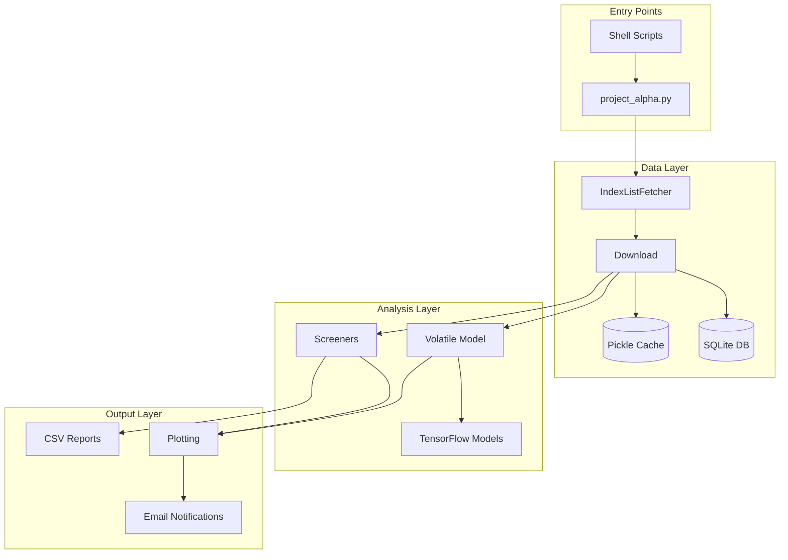
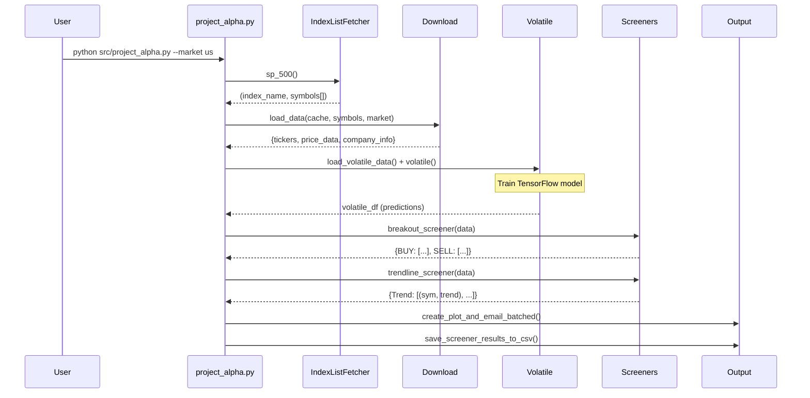

# Project Alpha - Architecture Documentation

> A comprehensive stock market analysis and screening toolkit supporting US and Indian markets.

## Overview

Project Alpha is a Python-based stock market analysis application that combines **volatility-based predictions** with **technical screening strategies**. It downloads historical price data, trains probabilistic volatility models using TensorFlow, and runs various technical screeners to identify trading opportunities.

---

## High-Level Architecture



---

## Directory Structure

```
project_alpha/
├── src/
│   ├── project_alpha.py          # Main entry point
│   └── classes/                   # Core modules (22 files)
│       ├── Download.py            # Data fetching & caching
│       ├── DatabaseManager.py     # SQLite persistence
│       ├── Volatile.py            # Volatility predictions
│       ├── Models.py              # TensorFlow probabilistic models
│       ├── Screener.py            # Main screening logic (~800 lines)
│       ├── Screener_*.py          # Specialized screeners (7 files)
│       ├── IndexListFetcher.py    # Market index symbol lists
│       ├── Plotting.py            # Visualization (matplotlib)
│       ├── Send_email.py          # Email notifications
│       ├── Tools.py               # Shared utilities
│       └── ...
├── scripts/
│   └── migrate_pickle_to_db.py   # Cache migration utility
├── website/                       # Simple SVG viewer (HTML/CSS/JS)
├── run_us_stock_scanner.sh       # Scheduled US market scan
├── run_india_stock_scanner.sh    # Scheduled India market scan
├── pyproject.toml                # Poetry dependencies
└── README.md
```

---

## Core Components

### 1. Data Layer

| Component | File | Responsibility |
|-----------|------|----------------|
| **IndexListFetcher** | [IndexListFetcher.py](file:///opt/developments/project_alpha/src/classes/IndexListFetcher.py) | Fetches stock symbol lists for various indices (S&P 500, NASDAQ, NSE 500, etc.) via web scraping |
| **Download** | [Download.py](file:///opt/developments/project_alpha/src/classes/Download.py) | Multi-threaded price download using `yfinance`, handles caching and exchange rates |
| **DatabaseManager** | [DatabaseManager.py](file:///opt/developments/project_alpha/src/classes/DatabaseManager.py) | SQLite-based persistence with `price_data` and `company_info` tables |

**Data Flow:**
1. Fetch symbol lists from external sources (Wikipedia, NSE, stockmonitor.com)
2. Download OHLCV data via yfinance with multi-threading (`@multitasking.task`)
3. Cache data as pickle files OR persist to SQLite database
4. Load cached data on subsequent runs to avoid re-downloading

---

### 2. Model Layer

| Component | File | Responsibility |
|-----------|------|----------------|
| **Models** | [Models.py](file:///opt/developments/project_alpha/src/classes/Models.py) | TensorFlow Probability models for volatility estimation |
| **Volatile** | [Volatile.py](file:///opt/developments/project_alpha/src/classes/Volatile.py) | Prediction generation, trend rating, stock clustering |

**Model Architecture:**
- **Hierarchical Bayesian Model**: Market → Sector → Industry → Stock levels
- **Polynomial regression** for trend estimation
- **Gaussian conjugate model** for sequential log-price prediction
- Uses `TensorFlow 2.14` with `TensorFlow Probability 0.22`

**Key Functions:**
- `train_msis_mcs()` - Sequential Adam optimization across hierarchy levels
- `estimate_logprice_statistics()` - Mean/variance estimation
- `rate()` - Classifies stocks as "HIGHLY BELOW TREND" to "HIGHLY ABOVE TREND"

---

### 3. Screening Layer

| Screener | File | Strategy |
|----------|------|----------|
| **Main Screener** | [Screener.py](file:///opt/developments/project_alpha/src/classes/Screener.py) | 25+ validation methods (VCP, Lorentzian, trendlines, volume, RSI, etc.) |
| **MA Screener** | [Screener_ma.py](file:///opt/developments/project_alpha/src/classes/Screener_ma.py) | Moving average crossover strategies (10/30/50/200 SMA) |
| **MACD Screener** | [Screener_macd.py](file:///opt/developments/project_alpha/src/classes/Screener_macd.py) | MACD signal line crossovers |
| **Breakout** | [Screener_breakout.py](file:///opt/developments/project_alpha/src/classes/Screener_breakout.py) | Price & volume breakout detection |
| **Trendline** | [Screener_trendline.py](file:///opt/developments/project_alpha/src/classes/Screener_trendline.py) | Strong uptrend identification via slope analysis |
| **Donchian** | [Screener_donchain.py](file:///opt/developments/project_alpha/src/classes/Screener_donchain.py) | Channel breakout strategy |
| **Value** | [Screener_value.py](file:///opt/developments/project_alpha/src/classes/Screener_value.py) | Value investing metrics |

---

### 4. Output Layer

| Component | File | Output Type |
|-----------|------|-------------|
| **Plotting** | [Plotting.py](file:///opt/developments/project_alpha/src/classes/Plotting.py) | Market/sector/industry/stock trend charts with uncertainty bounds |
| **Plot_stocks** | [Plot_stocks.py](file:///opt/developments/project_alpha/src/classes/Plot_stocks.py) | Candlestick charts with indicators |
| **Send_email** | [Send_email.py](file:///opt/developments/project_alpha/src/classes/Send_email.py) | SMTP-based email with CSV/image attachments |
| **Tools** | [Tools.py](file:///opt/developments/project_alpha/src/classes/Tools.py) | CSV export, progress bars, TradingView integration |

---

## Market Support

| Market | Index Functions | Symbol Format |
|--------|-----------------|---------------|
| **US** | `sp_500()`, `nasdaq_all()`, `dow_jones()`, `tech_100()` | Ticker only (e.g., `AAPL`) |
| **India** | `nse_500()`, `nse_50()`, `nse_100()`, `nse_all()` | Ticker with `.NS` suffix |

---

## Execution Flow



---

## Technology Stack

| Category | Technology | Version |
|----------|------------|---------|
| **Language** | Python | ≥3.11, <3.13 |
| **ML Framework** | TensorFlow + TensorFlow Probability | 2.14.0 / 0.22.0 |
| **Data Processing** | Pandas, NumPy | 2.3.0+ / 1.26.4 |
| **Technical Analysis** | pandas-ta, advanced-ta | 0.3.14b0 / 0.1.8 |
| **Data Source** | yfinance, TradingView-TA | 0.2.63 / 3.3.0 |
| **Visualization** | Matplotlib, Plotly | 3.10.3 / 6.1.2 |
| **Web Scraping** | BeautifulSoup4, Requests | 4.13.4 / 2.32.4 |
| **Database** | SQLite3 | Built-in |
| **Package Manager** | Poetry | 2.0+ |

---

## Configuration

### Command-Line Arguments

| Argument | Type | Default | Description |
|----------|------|---------|-------------|
| `--market` | str | `us` | Market selection (`us` or `india`) |
| `--rank` | str | `growth` | Ranking method: `rate`, `growth`, `volatility` |
| `--cache` | flag | `True` | Use cached data if available |
| `--db-path` | str | None | SQLite database path for persistence |
| `--save-table` | flag | `True` | Export prediction table to CSV |
| `--no-plots` | flag | False | Disable chart generation |
| `--load-model` | str | None | Load pre-trained model parameters |
| `--save-model` | str | None | Save trained model parameters |

---

## Data Storage

### Pickle Cache
- Location: `data/historic_data/{market}/{index}_data_YYMMDD.pkl`
- Contains: `{tickers, price_data, company_info, sectors, industries, currencies}`

### SQLite Database (Optional)
```sql
-- Tables
price_data(symbol, date, open, high, low, close, adj_close, volume, dividends, splits)
company_info(symbol, info_json)
```

### Output Files
- Charts: `data/processed_data/{screener_name}/*.svg`
- CSV Reports: `data/processed_data/screener_{name}/*.csv`
- Logs: `logs/project_alpha_{market}.log`
