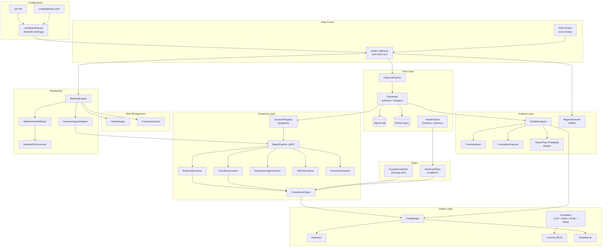
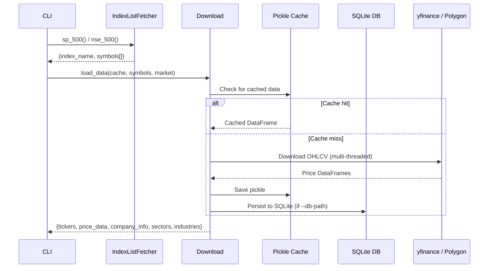
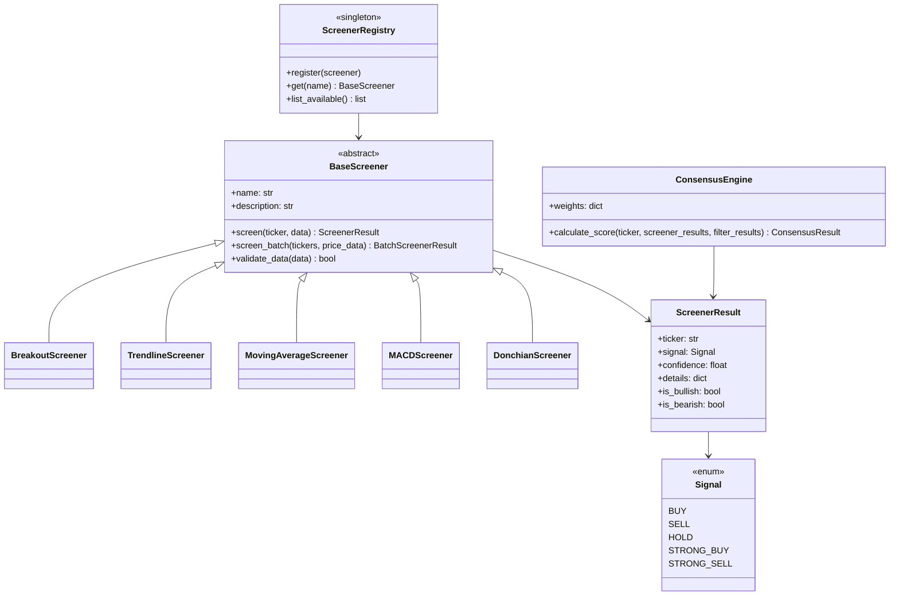
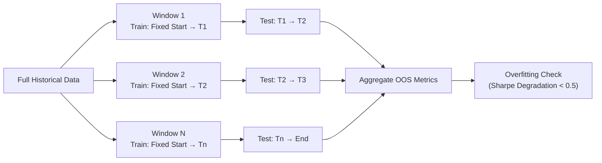
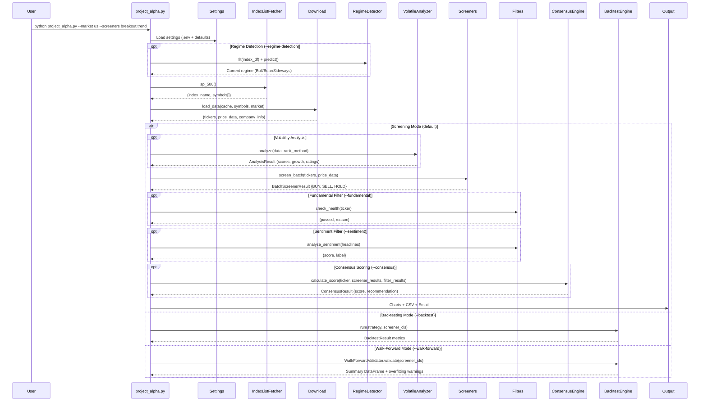

# Project Alpha — Architecture Documentation

> A comprehensive stock market analysis and screening toolkit supporting US and Indian markets, featuring volatility modeling, technical screening, backtesting, risk management, and AI-powered filters.

---

## High-Level Architecture



---

## Directory Structure

```
project_alpha/
├── src/
│   ├── project_alpha.py              # CLI entry point (~1 070 lines, rich-click)
│   ├── exceptions.py                 # Custom exception hierarchy
│   ├── logging_config.py             # structlog configuration
│   │
│   ├── config/
│   │   ├── settings.py               # Pydantic Settings (env + .env + defaults)
│   │   └── defaults.yaml             # YAML defaults for model/screener/risk params
│   │
│   └── classes/
│       ├── Download.py               # Multi-threaded data fetching (yfinance/Polygon)
│       ├── DatabaseManager.py        # SQLite persistence layer
│       ├── IndexListFetcher.py       # Market index symbol resolution
│       ├── Volatile.py               # Legacy volatile prediction interface
│       ├── Models.py                 # TensorFlow Probability model definitions
│       ├── Plotting.py               # Legacy matplotlib visualizations
│       ├── Tools.py                  # Shared utilities (CSV, TradingView, cleanup)
│       ├── ScreenipyTA.py            # Technical analysis helpers (screenipy)
│       ├── Add_indicators.py         # Technical indicator additions
│       │
│       ├── analysis/                 # Modular volatility analysis pipeline
│       │   ├── VolatileAnalyzer.py   # Main orchestrator (AnalysisResult)
│       │   ├── TrendAnalyzer.py      # Hierarchical Bayesian trend models
│       │   ├── CorrelationAnalyzer.py# Stock correlation and matching
│       │   ├── VolatileConfig.py     # Dataclass configs (TrainingConfig, RatingThresholds)
│       │   └── regime.py             # HMM-based market regime detection
│       │
│       ├── screeners/                # Pluggable screener framework
│       │   ├── base.py               # BaseScreener ABC, Signal enum, ScreenerResult
│       │   ├── registry.py           # ScreenerRegistry singleton + decorator
│       │   ├── consensus.py          # ConsensusEngine (weighted multi-signal aggregation)
│       │   ├── breakout.py           # Price & volume breakout detection
│       │   ├── trendline.py          # Uptrend identification via slope analysis
│       │   ├── moving_average.py     # SMA crossover strategies (10/30/50/200)
│       │   ├── macd.py               # MACD signal line crossovers
│       │   └── donchian.py           # Donchian channel breakout strategy
│       │
│       ├── filters/                  # Post-screening stock filters
│       │   ├── fundamental_filter.py # Finnhub-based financial health checks
│       │   └── sentiment_filter.py   # FinBERT NLP sentiment analysis
│       │
│       ├── risk/                     # Risk management framework
│       │   ├── risk_manager.py       # Position sizing, stop-loss, exposure limits
│       │   └── transaction_costs.py  # Commission + slippage + spread modeling
│       │
│       ├── backtesting/              # Strategy validation framework
│       │   ├── engine.py             # BacktestEngine + ProjectAlphaStrategy
│       │   ├── adapter.py            # ScreenerSignalAdapter (point-in-time signals)
│       │   ├── walk_forward.py       # Walk-Forward Validation (expanding windows)
│       │   └── performance.py        # BacktestResult dataclass + HTML reports
│       │
│       ├── output/                   # Formatting and delivery
│       │   ├── charts.py             # ChartBuilder (candlestick + indicators)
│       │   ├── formatters.py         # CSV / JSON / HTML / Table formatters
│       │   ├── exporters.py          # File export utilities
│       │   ├── console.py            # Rich console UI (banners, tables, progress)
│       │   └── email.py              # EmailConfig + EmailServer (SMTP + attachments)
│       │
│       ├── data/                     # External data fetchers
│       │   └── news_fetcher.py       # News headlines (Finnhub → yfinance fallback)
│       │
│       └── _archive/                 # Deprecated legacy modules
│           ├── Screener.py           # Monolithic screener (~40 KB, superseded)
│           ├── Screener_*.py         # Old standalone screeners
│           ├── Send_email.py         # Old email implementation
│           ├── Plot_stocks.py        # Old plotting
│           ├── Console.py            # Old console output
│           └── Evaluation.py         # Old evaluation logic
│
├── tests/
│   ├── unit/                         # 15 unit test modules
│   │   ├── test_backtesting.py
│   │   ├── test_walk_forward.py
│   │   ├── test_screeners.py
│   │   ├── test_consensus.py
│   │   ├── test_filters.py
│   │   ├── test_risk_manager.py
│   │   ├── test_transaction_costs.py
│   │   ├── test_regime.py
│   │   ├── test_config.py
│   │   ├── test_database_manager.py
│   │   ├── test_download.py
│   │   ├── test_models.py
│   │   ├── test_provider_chain.py
│   │   ├── test_data_repair.py
│   │   └── test_breakout_confirmation.py
│   │
│   ├── integration/                  # Integration tests
│   │   ├── test_download_module.py
│   │   └── test_pipeline.py
│   │
│   ├── test_data_layer.py
│   ├── test_analysis_layer.py
│   ├── test_screeners.py
│   ├── test_output.py
│   └── conftest.py
│
├── scripts/
│   ├── migrate_pickle_to_db.py       # Pickle → SQLite migration
│   └── run_daily_analysis.sh         # Automated daily analysis
│
├── website/                          # Minimal SVG chart viewer (HTML/CSS/JS)
│
├── run_us_stock_scanner.sh           # Cron-ready US market scan
├── run_india_stock_scanner.sh        # Cron-ready India market scan
├── pyproject.toml                    # Poetry dependencies & project metadata
├── Dockerfile                        # Container build
└── docker-compose.yml                # Service orchestration
```

---

## Core Components

### 1. Configuration Layer

| Component | File | Responsibility |
|-----------|------|----------------|
| **Settings** | [settings.py](file:///opt/developments/project_alpha/src/config/settings.py) | Central Pydantic Settings model — loads from `.env` (prefix `PA_`), environment vars, and code defaults. Covers data, model, screener, consensus, risk, email, and API key settings. |
| **Defaults** | [defaults.yaml](file:///opt/developments/project_alpha/src/config/defaults.yaml) | YAML defaults for model hyperparameters, screener thresholds, and risk parameters |
| **Logging** | [logging_config.py](file:///opt/developments/project_alpha/src/logging_config.py) | `structlog` configuration with console (colored) or JSON output modes |
| **Exceptions** | [exceptions.py](file:///opt/developments/project_alpha/src/exceptions.py) | Custom hierarchy: `ProjectAlphaError` → `DataFetchError`, `ScreenerError`, `ModelTrainingError`, `ConfigurationError`, `DataValidationError` |

**Configuration Precedence:** CLI flags → Environment variables (`PA_*`) → `.env` file → Code defaults

---

### 2. Data Layer

| Component | File | Responsibility |
|-----------|------|----------------|
| **IndexListFetcher** | [IndexListFetcher.py](file:///opt/developments/project_alpha/src/classes/IndexListFetcher.py) | Resolves market index symbol lists via web scraping (Wikipedia, NSE, stockmonitor.com) |
| **Download** | [Download.py](file:///opt/developments/project_alpha/src/classes/Download.py) | Multi-threaded price download with provider abstraction (`yfinance` / `Polygon.io`), caching, and exchange rate handling |
| **DatabaseManager** | [DatabaseManager.py](file:///opt/developments/project_alpha/src/classes/DatabaseManager.py) | SQLite persistence with `price_data` and `company_info` tables |
| **NewsFetcher** | [news_fetcher.py](file:///opt/developments/project_alpha/src/classes/data/news_fetcher.py) | News headline fetcher with Finnhub API primary, yfinance fallback |

**Data Flow:**



---

### 3. Analysis Layer

| Component | File | Responsibility |
|-----------|------|----------------|
| **VolatileAnalyzer** | [VolatileAnalyzer.py](file:///opt/developments/project_alpha/src/classes/analysis/VolatileAnalyzer.py) | Main orchestrator — coordinates model training, trend analysis, correlation analysis, and returns `AnalysisResult` |
| **TrendAnalyzer** | [TrendAnalyzer.py](file:///opt/developments/project_alpha/src/classes/analysis/TrendAnalyzer.py) | Hierarchical Bayesian trend estimation using TensorFlow Probability |
| **CorrelationAnalyzer** | [CorrelationAnalyzer.py](file:///opt/developments/project_alpha/src/classes/analysis/CorrelationAnalyzer.py) | Stock correlation matching and similarity scoring |
| **VolatileConfig** | [VolatileConfig.py](file:///opt/developments/project_alpha/src/classes/analysis/VolatileConfig.py) | Typed dataclass configs: `VolatileConfig`, `TrainingConfig`, `RatingThresholds` |
| **RegimeDetector** | [regime.py](file:///opt/developments/project_alpha/src/classes/analysis/regime.py) | HMM-based market regime detection (Bull / Bear / Sideways) using `hmmlearn` |

**Model Architecture:**
- **Hierarchical Bayesian Model**: Market → Sector → Industry → Stock levels (MSIS-MCS training)
- **Polynomial regression** for trend estimation (configurable order)
- **Gaussian conjugate model** for sequential log-price prediction
- **Hidden Markov Model** for regime detection using log-returns + rolling volatility features

**Key Outputs:**
- `AnalysisResult`: scores, growth, volatility, ratings, correlation matches
- Stock ratings: `HIGHLY BELOW TREND` → `HIGHLY ABOVE TREND`
- Regime labels: `Bull`, `Bear`, `Sideways`

---

### 4. Screening Layer

The screener framework uses a **pluggable architecture** with a base class, registry, and consensus engine.

#### Screener Framework



#### Available Screeners

| Screener | File | Strategy |
|----------|------|----------|
| **Breakout** | [breakout.py](file:///opt/developments/project_alpha/src/classes/screeners/breakout.py) | Price & volume breakout detection with ADX trend strength and ATR expansion filtering |
| **Trendline** | [trendline.py](file:///opt/developments/project_alpha/src/classes/screeners/trendline.py) | Strong uptrend identification via slope analysis |
| **Moving Average** | [moving_average.py](file:///opt/developments/project_alpha/src/classes/screeners/moving_average.py) | SMA crossover strategies (10/30/50/200 periods) |
| **MACD** | [macd.py](file:///opt/developments/project_alpha/src/classes/screeners/macd.py) | MACD signal line crossovers |
| **Donchian** | [donchian.py](file:///opt/developments/project_alpha/src/classes/screeners/donchian.py) | Channel breakout strategy |

#### Consensus Engine

The `ConsensusEngine` aggregates signals from multiple screeners and filters into a single confidence score:

```
Default Weights:
  breakout:    0.4
  trend:       0.3
  volatility:  0.1
  fundamental: 0.1
  sentiment:   0.1
```

Includes a **synergy bonus** (+0.1) when both Breakout and Trend signals are present.

---

### 5. Filters

Post-screening filters that further refine symbol lists:

| Filter | File | Data Source | Technique |
|--------|------|-------------|-----------|
| **FundamentalFilter** | [fundamental_filter.py](file:///opt/developments/project_alpha/src/classes/filters/fundamental_filter.py) | Finnhub API | Debt/Equity < 200%, P/E ratio bounds, ROE > 0, Revenue Growth > 0. Results cached with `@lru_cache`. |
| **SentimentFilter** | [sentiment_filter.py](file:///opt/developments/project_alpha/src/classes/filters/sentiment_filter.py) | FinBERT (HuggingFace) | NLP sentiment scoring of news headlines. Lazy singleton model loading. Score range: -1.0 to +1.0. |

Both filters **degrade gracefully** — if API keys are missing or models fail to load, they pass all stocks through.

---

### 6. Risk Management

| Component | File | Responsibility |
|-----------|------|----------------|
| **RiskManager** | [risk_manager.py](file:///opt/developments/project_alpha/src/classes/risk/risk_manager.py) | ATR-based stop-loss calculation, Kelly-style position sizing (`Risk Amount / Risk Per Share`), exposure validation |
| **TransactionCosts** | [transaction_costs.py](file:///opt/developments/project_alpha/src/classes/risk/transaction_costs.py) | Commission + slippage + spread modeling with `us_default()` and `india_default()` presets |

**Key Parameters** (from `Settings`):

| Parameter | Default | Description |
|-----------|---------|-------------|
| `risk_per_trade` | 1% | Maximum capital risked per trade |
| `atr_multiplier` | 2.0× | Stop-loss distance in ATR units |
| `atr_period` | 14 | ATR calculation lookback |
| `max_positions` | 10 | Concurrent open position limit |
| `max_portfolio_exposure` | 100% | Total portfolio exposure cap |
| `trailing_stop` | `True` | Enable trailing stop-loss |

---

### 7. Backtesting Framework

| Component | File | Responsibility |
|-----------|------|----------------|
| **BacktestEngine** | [engine.py](file:///opt/developments/project_alpha/src/classes/backtesting/engine.py) | Wrapper around `backtesting.py` library. Configures and runs strategy backtests. |
| **ProjectAlphaStrategy** | [engine.py](file:///opt/developments/project_alpha/src/classes/backtesting/engine.py) | Base `Strategy` subclass integrating screener signals with `RiskManager` logic (ATR stop-loss, position sizing) |
| **ScreenerSignalAdapter** | [adapter.py](file:///opt/developments/project_alpha/src/classes/backtesting/adapter.py) | Adapts `BaseScreener` to historical signal generation. Supports point-in-time iteration and vectorized fast-paths for Breakout/Trend. |
| **WalkForwardValidator** | [walk_forward.py](file:///opt/developments/project_alpha/src/classes/backtesting/walk_forward.py) | Anchored expanding window validation. Runs sequential IS/OOS backtests and computes Sharpe degradation for overfitting detection. |
| **BacktestPerformance** | [performance.py](file:///opt/developments/project_alpha/src/classes/backtesting/performance.py) | Extracts metrics into `BacktestResult` dataclass (30+ fields) and generates interactive HTML reports |

**Walk-Forward Validation Flow:**



---

### 8. Output Layer

| Component | File | Responsibility |
|-----------|------|----------------|
| **ChartBuilder** | [charts.py](file:///opt/developments/project_alpha/src/classes/output/charts.py) | Candlestick charts with technical indicators, batch chart generation |
| **Formatters** | [formatters.py](file:///opt/developments/project_alpha/src/classes/output/formatters.py) | `ResultFormatter` base with `CSVFormatter`, `JSONFormatter`, `TableFormatter`, `HTMLFormatter` |
| **Exporters** | [exporters.py](file:///opt/developments/project_alpha/src/classes/output/exporters.py) | File-based export utilities (`export_csv`, `export_json`, `export_html`) |
| **Console** | [console.py](file:///opt/developments/project_alpha/src/classes/output/console.py) | Rich-powered terminal UI — banners, section headers, progress bars, result tables, config/summary panels |
| **EmailServer** | [email.py](file:///opt/developments/project_alpha/src/classes/output/email.py) | SMTP email with inline charts, CSV data, and PDF report attachments |

---

## Market Support

| Market | Index Functions | Symbol Format | Data Provider |
|--------|-----------------|---------------|---------------|
| **US** | `sp_500()`, `nasdaq_all()`, `dow_jones()`, `tech_100()` | Ticker only (e.g., `AAPL`) | yfinance / Polygon.io |
| **India** | `nse_500()`, `nse_50()`, `nse_100()`, `nse_all()` | `.NS` suffix (e.g., `RELIANCE.NS`) | yfinance |

---

## Execution Flow



---

## Command-Line Interface

The CLI is built with `rich-click` and organized into 8 option groups:

### Market Selection

| Argument | Type | Default | Description |
|----------|------|---------|-------------|
| `--market` | `us` / `india` | `us` | Market to analyze |
| `--symbols` | str (multiple) | — | Specific symbols (overrides market) |

### Screener Configuration

| Argument | Type | Default | Description |
|----------|------|---------|-------------|
| `--screeners` | comma-separated | `all` | `all`, `volatility`, `breakout`, `trend`, `ma`, `macd`, `donchain` |
| `--rank` | choice | `growth` | Ranking: `rate`, `growth`, `volatility` |
| `--top` | int | — | Limit to top N stocks |
| `--min-price` / `--max-price` | float | — | Price range filter |

### Output Options

| Argument | Type | Default | Description |
|----------|------|---------|-------------|
| `--format` | choice | `table` | Output: `table`, `csv`, `json` |
| `--save-table` / `--no-save-table` | flag | `True` | Save results to CSV |
| `--no-plots` | flag | `False` | Disable chart generation |
| `--verbose` / `--quiet` | flag | — | Log verbosity control |
| `--json-logs` | flag | `False` | Structured JSON log output |
| `--log-level` | choice | `INFO` | `DEBUG`, `INFO`, `WARNING`, `ERROR` |

### Data & Caching

| Argument | Type | Default | Description |
|----------|------|---------|-------------|
| `--cache` / `--no-cache` | flag | `True` | Use cached data |
| `--db-path` | path | — | SQLite database path |
| `--data-provider` | choice | `yfinance` | `yfinance` / `polygon` |
| `--polygon-api-key` | str | — | Polygon.io API key |

### Model Options

| Argument | Type | Default | Description |
|----------|------|---------|-------------|
| `--load-model` | path | — | Load pre-trained model parameters |
| `--save-model` | path | — | Save trained model parameters |

### Risk Management

| Argument | Type | Default | Description |
|----------|------|---------|-------------|
| `--risk-per-trade` | float | `0.01` | Risk per trade (1%) |
| `--atr-multiplier` | float | `2.0` | ATR multiplier for stop-loss |
| `--max-positions` | int | `10` | Max concurrent positions |

### Backtesting

| Argument | Type | Default | Description |
|----------|------|---------|-------------|
| `--backtest` | flag | `False` | Run backtest mode |
| `--initial-capital` | float | `10000` | Starting capital |
| `--benchmark` | str | `SPY` | Benchmark symbol |
| `--walk-forward` | flag | `False` | Walk-forward validation mode |
| `--wf-train-months` | int | `12` | Training window (months) |
| `--wf-test-months` | int | `3` | Testing window (months) |

### Additional Features

| Argument | Type | Default | Description |
|----------|------|---------|-------------|
| `--fundamental` / `--no-fundamental` | flag | `False` | Enable fundamental analysis (Finnhub) |
| `--sentiment` / `--no-sentiment` | flag | `False` | Enable sentiment analysis (FinBERT) |
| `--consensus` / `--no-consensus` | flag | `False` | Enable multi-signal consensus scoring |
| `--regime-detection` | flag | `False` | Enable HMM regime detection |
| `--regime-index` | str | `SPY` | Index for regime detection |
| `--value` | flag | `False` | Include value stocks (India only) |

---

## Technology Stack

| Category | Technology | Version |
|----------|------------|---------|
| **Language** | Python | ≥3.12, <3.14 |
| **ML Framework** | TensorFlow + TensorFlow Probability | ≥2.20 / ≥0.25 |
| **ML Utilities** | scikit-learn, hmmlearn | ≥1.5 / ≥0.3.3 |
| **NLP** | HuggingFace Transformers + PyTorch (FinBERT) | ≥5.2 / ≥2.10 |
| **Data Processing** | Pandas, NumPy, SciPy | ≥2.0 / ≥2.1 / ≥1.14 |
| **Technical Analysis** | `ta` (technical analysis library) | ≥0.11 |
| **Data Sources** | yfinance, Polygon.io, Finnhub, TradingView-TA | ≥0.2.63 / ≥1.16 / ≥2.4 / ≥3.3 |
| **Backtesting** | backtesting.py, pyfolio-reloaded | ≥0.3.3 / ≥0.9.5 |
| **Visualization** | Matplotlib, Plotly, Kaleido | ≥3.8 / ≥5.18 / ≥1.2 |
| **CLI** | Click + rich-click + Rich | ≥8.1 / ≥1.8 / ≥14.0 |
| **Web Scraping** | BeautifulSoup4, Requests | ≥4.12 / ≥2.32 |
| **Configuration** | Pydantic Settings | ≥2.0 |
| **Logging** | structlog | ≥24.0 |
| **Database** | SQLite3 | Built-in |
| **Reports** | ReportLab (PDF) | ≥4.4.9 |
| **Package Manager** | Poetry | 2.0+ |

---

## Data Storage

### Pickle Cache
- **Location:** `data/historic_data/{market}/{index}_data_YYMMDD.pkl`
- **Contents:** `{tickers, price_data, company_info, sectors, industries, currencies}`

### SQLite Database (Optional — `--db-path`)
```sql
price_data(symbol, date, open, high, low, close, adj_close, volume, dividends, splits)
company_info(symbol, info_json)
```

### Output Files
- **Charts:** `data/processed_data/{screener_name}/*.svg`
- **CSV Reports:** `data/processed_data/screener_{name}/*.csv`
- **Backtest Reports:** `data/processed_data/backtest_report.html`
- **Logs:** `logs/project_alpha_{market}.log`

---

## Testing

Tests are organized into unit and integration suites:

| Suite | Coverage |
|-------|----------|
| **Unit** (15 modules) | Backtesting, walk-forward, screeners, consensus, filters, risk manager, transaction costs, regime detection, config, database, download, models, provider chain, data repair, breakout confirmation |
| **Integration** (2 modules) | Download pipeline, end-to-end screening pipeline |

Run tests with:
```bash
pytest tests/ -v --cov=src
```

---

## Deployment

### Docker
```bash
docker compose up --build
```

### Cron Scheduling
```bash
# US market scan (daily at 4:30 PM ET)
30 16 * * 1-5 /path/to/run_us_stock_scanner.sh

# India market scan (daily at 3:45 PM IST)
45 15 * * 1-5 /path/to/run_india_stock_scanner.sh
```

### Environment Variables
All settings can be overridden with `PA_` prefix:
```bash
export PA_MARKET=us
export PA_FINNHUB_API_KEY=your_key
export PA_POLYGON_API_KEY=your_key
export PA_RISK_PER_TRADE=0.02
```
