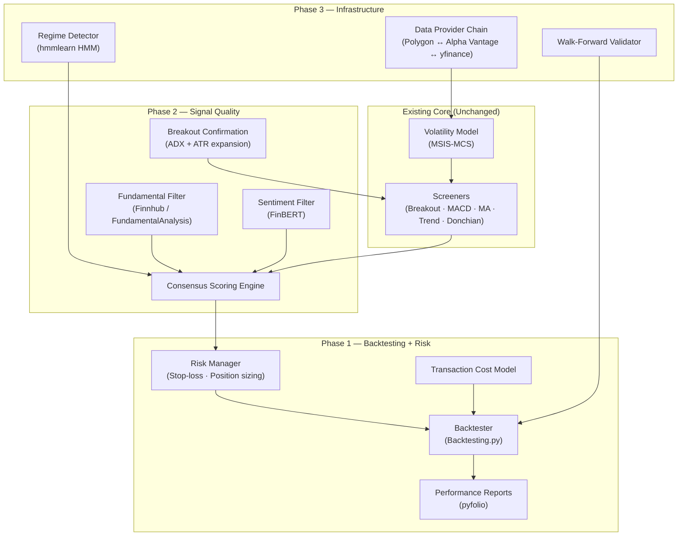
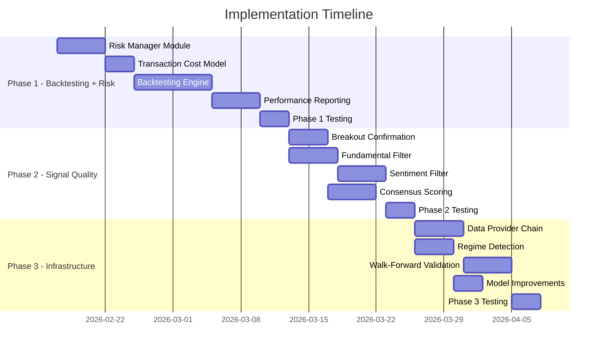

# Project Alpha — Three-Phase Implementation Roadmap

> Research-backed TODO list for upgrading Project Alpha from a screening tool to a complete trading analysis platform.

---

## Architecture Overview

The roadmap adds three new layers around the existing pipeline without modifying its core:



---

## New Dependencies Summary

| Package | Version | Phase | Purpose |
|---------|---------|-------|---------|
| `backtesting` | ≥ 0.3.3 | 1 | Backtesting engine |
| `pyfolio-reloaded` | ≥ 0.9.5 | 1 | Performance/risk analytics |
| `pandas-ta` | ≥ 0.3.14b | 1 | ATR, ADX indicators (already present) |
| `transformers` | ≥ 4.36 | 2 | FinBERT sentiment model |
| `torch` | ≥ 2.1 | 2 | FinBERT backend |
| `fundamentalanalysis` | ≥ 0.3.1 | 2 | Fundamental data via FMP API |
| `finnhub-python` | ≥ 2.4 | 2 | Fundamentals + sentiment API |
| `polygon-api-client` | ≥ 1.12 | 3 | Fallback data provider |
| `alpha-vantage` | ≥ 2.3 | 3 | Fallback data provider |
| `hmmlearn` | ≥ 0.3.0 | 3 | Market regime detection |

---

## Phase 1: Backtesting + Risk Management

**Goal:** Prove whether the strategy makes money, and protect capital when it doesn't.

**Estimated Effort:** 3–4 weeks

---

### 1.1 Risk Manager Module

> [!IMPORTANT]
> This is the foundation all other Phase 1 work depends on.

#### New File: `src/classes/risk/risk_manager.py`

```python
@dataclass
class RiskConfig:
    max_risk_per_trade: float = 0.01       # 1% of portfolio per trade
    atr_multiplier: float = 2.0            # Stop-loss = entry - 2×ATR
    atr_period: int = 14
    max_portfolio_exposure: float = 0.25   # Max 25% of portfolio in one sector
    max_open_positions: int = 10
    trailing_stop: bool = True

class RiskManager:
    def calculate_stop_loss(self, entry: float, atr: float) -> float
    def calculate_position_size(self, portfolio_value: float, entry: float, stop_loss: float) -> int
    def check_portfolio_limits(self, current_positions: List[Position]) -> bool
    def update_trailing_stop(self, position: Position, current_price: float) -> float
```

#### TODO Checklist

- [ ] **1.1.1** Create `src/classes/risk/__init__.py` and `risk_manager.py`
- [ ] **1.1.2** Implement `RiskConfig` dataclass with CLI argument mapping
- [ ] **1.1.3** Implement ATR-based stop-loss calculation
  ```python
  def calculate_stop_loss(self, entry_price: float, atr: float) -> float:
      return entry_price - (self.config.atr_multiplier * atr)
  ```
- [ ] **1.1.4** Implement fixed-risk position sizing
  ```python
  def calculate_position_size(self, portfolio_value, entry, stop_loss):
      risk_amount = portfolio_value * self.config.max_risk_per_trade
      risk_per_share = abs(entry - stop_loss)
      return int(risk_amount / risk_per_share) if risk_per_share > 0 else 0
  ```
- [ ] **1.1.5** Implement trailing stop logic (ATR-trailing: raise stop when price moves favourably, never lower it)
- [ ] **1.1.6** Implement portfolio-level exposure limits (max positions, sector concentration)
- [ ] **1.1.7** Add `--risk-per-trade`, `--atr-multiplier`, `--max-positions` CLI options to `project_alpha.py`
- [ ] **1.1.8** Write unit tests in `tests/test_risk_manager.py`

#### Research Notes

- **ATR stop-loss** uses `pandas_ta.atr(high, low, close, length=14)`. A multiplier of 2.0 is standard for swing trading; 1.5 for tighter, 3.0 for wider.
- **Position sizing formula**: `shares = (portfolio × risk_pct) / (entry - stop_loss)`. This ensures dollar risk is constant regardless of stock price.
- The trailing stop should use `max(current_stop, current_price - atr_multiplier × atr)` — it only ratchets up, never down.

---

### 1.2 Transaction Cost Model

#### New File: `src/classes/risk/transaction_costs.py`

```python
@dataclass
class TransactionCosts:
    commission_per_trade: float = 0.0     # Many brokers now zero-commission
    slippage_bps: float = 5.0             # 0.05% slippage
    spread_bps: float = 3.0               # Bid-ask half-spread
    tax_rate: float = 0.0                 # Capital gains tax (if applicable)
    
    def round_trip_cost(self, trade_value: float) -> float:
        """Total cost for a buy + sell."""
        pct = 2 * (self.slippage_bps + self.spread_bps) / 10000
        return trade_value * pct + 2 * self.commission_per_trade
```

#### TODO Checklist

- [ ] **1.2.1** Create `transaction_costs.py` with configurable cost model
- [ ] **1.2.2** Add India-specific STT/CTT defaults and US-specific defaults as presets
- [ ] **1.2.3** Integrate cost deduction into the backtesting loop (see 1.3)
- [ ] **1.2.4** Write unit tests

#### Research Notes

- **Zipline** separates slippage models (FixedSlippage, VolumeShareSlippage) from commission models (PerShare, PerDollar). This clean separation is worth emulating.
- For Indian markets: STT = 0.1% on sell, stamp duty = 0.015%. For US: most brokers are zero-commission but slippage still applies.

---

### 1.3 Backtesting Engine

#### New File: `src/classes/backtesting/engine.py`

Uses [Backtesting.py](https://github.com/kernc/backtesting.py) — chosen for simplicity, good visualisation, and Pandas compatibility.

```python
from backtesting import Strategy, Backtest

class ProjectAlphaStrategy(Strategy):
    """Wraps any BaseScreener into a Backtesting.py strategy."""
    
    screener_name = 'breakout'  # Parameterised
    risk_per_trade = 0.01
    atr_period = 14
    atr_multiplier = 2.0
    
    def init(self):
        # Pre-compute screener signals for every bar
        self.signal = self.I(self._compute_signals, self.data.df)
        self.atr = self.I(compute_atr, self.data.High, self.data.Low, self.data.Close)
    
    def next(self):
        if self.signal[-1] == 1 and not self.position:  # BUY signal
            stop = self.data.Close[-1] - self.atr_multiplier * self.atr[-1]
            size = self.risk_per_trade * self.equity / (self.data.Close[-1] - stop)
            self.buy(size=int(size), sl=stop)
        elif self.signal[-1] == -1 and self.position:  # SELL signal
            self.position.close()
```

#### TODO Checklist

- [ ] **1.3.1** Create `src/classes/backtesting/__init__.py` and `engine.py`
- [ ] **1.3.2** Implement `ScreenerSignalAdapter` — converts any `BaseScreener` into a signal array over historical data
  ```python
  class ScreenerSignalAdapter:
      def __init__(self, screener: BaseScreener)
      def compute_signals(self, df: pd.DataFrame) -> np.ndarray:
          """Run screener on rolling windows; return +1/0/-1 array."""
  ```
- [ ] **1.3.3** Implement `ProjectAlphaStrategy(Strategy)` — the Backtesting.py strategy wrapper
- [ ] **1.3.4** Integrate `RiskManager` for stop-loss and position sizing inside `next()`
- [ ] **1.3.5** Integrate `TransactionCosts` — apply costs on each trade
- [ ] **1.3.6** Implement `run_backtest(screener, ticker, data, config) -> BacktestResult`
- [ ] **1.3.7** Implement `run_batch_backtest(screener, tickers, data, config) -> BatchBacktestResult`
- [ ] **1.3.8** Add `--backtest` flag and `--initial-capital` CLI option to `project_alpha.py`
- [ ] **1.3.9** Generate interactive HTML backtest report (built into Backtesting.py via `bt.plot()`)
- [ ] **1.3.10** Write integration tests using known historical data with expected outcomes

#### Research Notes

- **Backtesting.py pattern**: `init()` pre-computes all indicators using `self.I(func, ...)` which wraps them for plotting. `next()` is called per bar with access to `self.data`, `self.position`, `self.equity`.
- The `self.I()` wrapper requires the function to return a Series/array of the same length as the data. The screener adapter must therefore run in a "rolling window" mode across all historical bars.
- **Alternatives considered**: VectorBT is faster for mass parameter sweeps but has a steeper API. Backtrader is feature-rich but more verbose. Backtesting.py hits the sweet spot for this project.

---

### 1.4 Performance Reporting

#### New File: `src/classes/backtesting/performance.py`

Uses [pyfolio](https://github.com/quantopian/pyfolio) for deep risk analytics.

#### TODO Checklist

- [ ] **1.4.1** Create `performance.py` with metrics calculation
- [ ] **1.4.2** Compute core metrics: Sharpe ratio, Sortino ratio, max drawdown, win rate, profit factor, CAGR
- [ ] **1.4.3** Generate tear sheet via pyfolio (drawdown plot, rolling Sharpe, monthly returns heatmap)
- [ ] **1.4.4** Output CSV summary of per-trade P&L
- [ ] **1.4.5** Integrate performance report into the email/PDF pipeline (leverage existing `output/email.py`)
- [ ] **1.4.6** Add `--benchmark SPY` option to compare strategy returns against a benchmark

#### Research Notes

- **pyfolio** generates "tear sheets" — comprehensive visual reports showing returns, drawdown, exposure, and risk metrics. It accepts a Pandas Series of returns indexed by datetime.
- The **Sharpe ratio** threshold: > 1.0 is acceptable, > 2.0 is good, > 3.0 is excellent. If backtesting reveals Sharpe < 0.5, the screener parameters need tuning.
- **Profit factor** = gross profits / gross losses. Below 1.0 means the strategy loses money.

---

### Phase 1 Test Plan

- [ ] **1.T.1** Unit tests for `RiskManager` — verify stop-loss, position sizing, trailing stop calculations
- [ ] **1.T.2** Unit tests for `TransactionCosts` — verify cost calculations for US and India presets
- [ ] **1.T.3** Integration test: run backtest on 1 year of AAPL data with BreakoutScreener, verify report generates
- [ ] **1.T.4** Smoke test: run full pipeline `python src/project_alpha.py --market us --backtest --top 5`
- [ ] **1.T.5** Validate that existing tests still pass (no regressions to core pipeline)

---

## Phase 2: Signal Quality Improvements

**Goal:** Reduce false signals by adding fundamental context, sentiment awareness, and cross-screener consensus.

**Estimated Effort:** 3–4 weeks

---

### 2.1 Breakout Confirmation Filters

#### Modified File: `src/classes/screeners/breakout.py`

Add ADX and ATR-expansion checks to the existing `BreakoutScreener.screen()` method.

#### TODO Checklist

- [ ] **2.1.1** Add ADX calculation using `pandas_ta.adx(high, low, close, length=14)`
- [ ] **2.1.2** Add ATR expansion check: require `atr_current > 1.5 × atr_20day_mean`
- [ ] **2.1.3** Add configurable thresholds: `adx_min=20`, `atr_expansion_factor=1.5`
- [ ] **2.1.4** Only emit BUY if existing breakout conditions AND confirmation filters pass
- [ ] **2.1.5** Add trendline direction filter: only flag breakouts in the direction of the prevailing trend
  ```python
  # Cross-reference with TrendlineScreener
  trend_result = TrendlineScreener().screen(ticker, data)
  if trend_result.details["trend"] in ["Strong Down", "Weak Down"]:
      return ScreenerResult(signal=Signal.HOLD, ...)  # Suppress counter-trend breakouts
  ```
- [ ] **2.1.6** Add optional TTM Squeeze detection (Bollinger inside Keltner)
- [ ] **2.1.7** Update existing breakout tests to cover new confirmation logic
- [ ] **2.1.8** Add new tests for edge cases (ADX exactly at threshold, ATR exactly at expansion ratio)

#### Research Notes

- **ADX > 20** confirms directional strength exists. ADX < 20 indicates a range-bound market where breakouts are more likely to fail.
- **ATR expansion** measures whether volatility is increasing — a necessary condition for genuine breakouts vs. noise.
- **TTM Squeeze**: Bollinger Band width < Keltner Channel width indicates compression. Release from squeeze + volume confirms breakout.

---

### 2.2 Fundamental Post-Filter

#### New File: `src/classes/filters/fundamental_filter.py`

Uses [FundamentalAnalysis](https://github.com/JerBouma/FundamentalAnalysis) or [Finnhub](https://github.com/Finnhub-Stock-API/finnhub-python).

```python
class FundamentalFilter:
    """Post-filter: suppress signals for fundamentally weak stocks."""
    
    def __init__(self, api_key: str, provider: str = "finnhub"):
        ...
    
    def should_suppress(self, ticker: str, signal: Signal) -> bool:
        """Return True if signal should be suppressed due to weak fundamentals."""
        # For BUY signals: suppress if negative earnings growth or excessive debt
        # For SELL signals: always allow
```

#### TODO Checklist

- [ ] **2.2.1** Create `src/classes/filters/__init__.py` and `fundamental_filter.py`
- [ ] **2.2.2** Implement Finnhub provider — fetch P/E, earnings growth, debt-to-equity
  ```python
  import finnhub
  client = finnhub.Client(api_key=api_key)
  metrics = client.company_basic_financials(ticker, 'all')
  ```
- [ ] **2.2.3** Implement FundamentalAnalysis provider as fallback
- [ ] **2.2.4** Define suppression rules:

  | Signal | Suppress If |
  |--------|------------|
  | BUY (Value) | Net income growth < 0 AND debt/equity > 2.0 |
  | BUY (Momentum) | Revenue declining 2+ consecutive quarters |
  | BUY (Breakout) | P/E > 100 (speculative territory) |

- [ ] **2.2.5** Add caching layer — cache fundamentals for 24 hours (most data updates quarterly)
- [ ] **2.2.6** Add `--fundamental-filter` and `--fmp-api-key` / `--finnhub-api-key` CLI options
- [ ] **2.2.7** Handle graceful fallback when API key is not provided (skip filter, log warning)
- [ ] **2.2.8** Write unit tests with mocked API responses

#### Research Notes

- **Finnhub** free tier: 60 calls/min, provides `company_basic_financials()` with 100+ metrics including revenueTTM, netIncomeTTM, debtToEquity, peRatio.
- **FundamentalAnalysis** library uses Financial Modeling Prep API — free tier: 250 calls/day. Provides `financial_ratios()`, `key_metrics()`, `financial_statement_growth()`.
- Caching is critical — for 500 stocks, uncached calls would exhaust free-tier limits.

---

### 2.3 Sentiment Filter

#### New File: `src/classes/filters/sentiment_filter.py`

Uses [FinBERT](https://github.com/ProsusAI/finBERT) (ProsusAI/finbert on HuggingFace).

```python
from transformers import pipeline

class SentimentFilter:
    def __init__(self, model_name="ProsusAI/finbert"):
        self.classifier = pipeline("sentiment-analysis", model=model_name)
    
    def get_sentiment(self, ticker: str, headlines: List[str]) -> SentimentResult:
        results = self.classifier(headlines)
        # Aggregate: count positive/negative/neutral, compute weighted score
        ...
    
    def should_suppress(self, ticker: str, signal: Signal, headlines: List[str]) -> bool:
        sentiment = self.get_sentiment(ticker, headlines)
        # Suppress BUY if sentiment is strongly negative
        if signal in (Signal.BUY, Signal.STRONG_BUY) and sentiment.score < -0.5:
            return True
        return False
```

#### TODO Checklist

- [ ] **2.3.1** Create `sentiment_filter.py` with FinBERT pipeline
- [ ] **2.3.2** Implement headline fetching — use `yfinance` news feed (already a dependency) as primary source
  ```python
  import yfinance as yf
  stock = yf.Ticker(ticker)
  headlines = [item['title'] for item in stock.news]
  ```
- [ ] **2.3.3** Implement Finnhub news API as fallback headline source
- [ ] **2.3.4** Implement sentiment aggregation: weighted average of FinBERT scores across recent headlines
- [ ] **2.3.5** Define suppression thresholds:
  - Suppress BUY if aggregate sentiment < −0.5 (strongly negative)
  - Boost confidence if sentiment > +0.5 (strongly positive) aligns with BUY
- [ ] **2.3.6** Add model caching — download FinBERT once, reuse from local cache
- [ ] **2.3.7** Add `--sentiment-filter` CLI flag (disabled by default — requires ~500 MB model download)
- [ ] **2.3.8** Handle case where no headlines are available (skip filter, don't suppress)
- [ ] **2.3.9** Write unit tests with fixture headlines

#### Research Notes

- **FinBERT** (`ProsusAI/finbert`) outputs `{'label': 'positive/negative/neutral', 'score': 0.0-1.0}` per text input.
- Model download is ~420 MB (first run only). Inference is fast: ~50ms per headline on CPU, ~5ms on GPU.
- **yfinance news** returns 8–15 recent headlines per ticker. For deeper coverage, Finnhub's `/company-news` endpoint provides historical news.

---

### 2.4 Consensus Scoring Engine

#### New File: `src/classes/screeners/consensus.py`

```python
class ConsensusScorer:
    """Combines signals from all screeners + filters into a single weighted score."""
    
    WEIGHTS = {
        "volatility": 0.30,
        "breakout": 0.20,
        "trendline": 0.15,
        "macd": 0.10,
        "donchian": 0.10,
        "moving_average": 0.10,
        "fundamental": 0.05,  # Only if enabled
    }
    
    def score(self, results: Dict[str, ScreenerResult]) -> ConsensusResult:
        ...
```

#### TODO Checklist

- [ ] **2.4.1** Create `consensus.py` with `ConsensusScorer` class
- [ ] **2.4.2** Implement weighted scoring: `score = Σ(weight × signal_value × confidence)`
  - Signal values: STRONG_BUY=1.0, BUY=0.5, HOLD=0.0, SELL=−0.5, STRONG_SELL=−1.0
- [ ] **2.4.3** Implement agreement detection — flag stocks where all screeners agree (high conviction)
- [ ] **2.4.4** Implement contradiction detection — flag stocks where screeners disagree (low conviction, HOLD)
- [ ] **2.4.5** Output consensus ranking with breakdown per screener
- [ ] **2.4.6** Add `--consensus` flag to `project_alpha.py` — replaces individual screener output with unified ranking
- [ ] **2.4.7** Add consensus column to CSV output and charts
- [ ] **2.4.8** Write unit tests covering agreement, contradiction, and edge cases (missing screeners)

#### Research Notes

- The weighting scheme prioritises the volatility model (probabilistic, broadest view) and breakout (most actionable), with lower weight for individual technical indicators that can be noisy in isolation.
- The consensus approach prevents acting on a single noisy signal, and contradictions cancel out naturally.

---

### Phase 2 Test Plan

- [ ] **2.T.1** Test breakout confirmation: verified breakouts (AAPL, TSLA known events) should pass; false breakouts should be caught
- [ ] **2.T.2** Test fundamental filter: stocks with negative earnings should be suppressed for BUY signals
- [ ] **2.T.3** Test sentiment filter: verify FinBERT correctly classifies sample financial headlines
- [ ] **2.T.4** Test consensus scoring: verify arithmetic, agreement/contradiction detection
- [ ] **2.T.5** End-to-end: run `--consensus --fundamental-filter` and verify output format

---

## Phase 3: Infrastructure Hardening

**Goal:** Make the system more reliable, adaptive, and statistically sound.

**Estimated Effort:** 2–3 weeks

---

### 3.1 Data Provider Chain

#### New File: `src/classes/data/provider_chain.py`

```python
class DataProviderChain:
    """Tries data providers in order; falls back on failure."""
    
    def __init__(self, providers: List[str] = ["yfinance", "polygon", "alpha_vantage"]):
        ...
    
    def fetch_historical(self, symbol, start, end, interval="1d") -> pd.DataFrame:
        for provider in self.providers:
            try:
                df = self._fetch(provider, symbol, start, end, interval)
                if len(df) > 0:
                    return self._normalise_columns(df)
            except Exception as e:
                logger.warning(f"{provider} failed for {symbol}: {e}")
        raise DataUnavailableError(f"All providers failed for {symbol}")
```

#### TODO Checklist

- [ ] **3.1.1** Create `provider_chain.py` with abstract `DataProvider` base class
- [ ] **3.1.2** Implement `YFinanceProvider` — wraps existing `yfinance` data fetching logic from `Download.py`
- [ ] **3.1.3** Implement `PolygonProvider` — uses `polygon-api-client`
  ```python
  from polygon import RESTClient
  client = RESTClient(api_key)
  aggs = client.get_aggs(ticker, 1, "day", start, end)
  df = pd.DataFrame([vars(a) for a in aggs])
  ```
- [ ] **3.1.4** Implement `AlphaVantageProvider` — uses `alpha_vantage` library
- [ ] **3.1.5** Implement column normalisation — ensure all providers return `Open, High, Low, Close, Volume` with DatetimeIndex
- [ ] **3.1.6** Add `--data-provider` and `--polygon-api-key` / `--av-api-key` CLI options
- [ ] **3.1.7** Integrate `DataProviderChain` into `Download.py` (replace direct yfinance calls)
- [ ] **3.1.8** Add rate limiting — respect per-provider API limits (Polygon: 5/min free, Alpha Vantage: 5/min)
- [ ] **3.1.9** Write integration tests with mocked provider responses
- [ ] **3.1.10** Add provider health check on startup — test connectivity, log available providers

#### Research Notes

- **Polygon.io** free tier: EOD data, 5 API calls/minute. `pip install polygon-api-client`. Client: `RESTClient(api_key).get_aggs(ticker, multiplier, timespan, from, to)`.
- **Alpha Vantage** free tier: 25 calls/day (reduced from 500 in 2024). `pip install alpha-vantage`. Consider as lowest-priority fallback.
- Column normalisation is critical — yfinance returns `Adj Close`, Polygon returns `vw` (VWAP), Alpha Vantage returns numbered columns.

---

### 3.2 Market Regime Detection

#### New File: `src/classes/analysis/regime_detector.py`

Uses [hmmlearn](https://github.com/hmmlearn/hmmlearn) with a 3-state Gaussian Hidden Markov Model.

```python
from hmmlearn import hmm

class RegimeDetector:
    def __init__(self, n_regimes: int = 3):
        self.model = hmm.GaussianHMM(
            n_components=n_regimes,
            covariance_type="full",
            n_iter=1000,
            random_state=42,
        )
    
    def fit_predict(self, market_data: pd.DataFrame) -> RegimeResult:
        # Features: log returns + rolling volatility
        features = self._compute_features(market_data)
        self.model.fit(features)
        states = self.model.predict(features)
        # Classify states by mean return: bull (highest), bear (lowest), neutral
        ...
```

#### TODO Checklist

- [ ] **3.2.1** Create `regime_detector.py` with `GaussianHMM` wrapper
- [ ] **3.2.2** Implement feature engineering: log returns + 20-day rolling volatility as observable features
- [ ] **3.2.3** Implement regime classification: label states by mean return
  - State with highest mean return → **Bull**
  - State with lowest mean return → **Bear**
  - Remaining state → **Neutral/Sideways**
- [ ] **3.2.4** Implement regime-based signal adjustment:

  | Regime | Effect |
  |--------|--------|
  | Bull | Allow all signals, boost momentum confidence |
  | Neutral | Allow all signals at face value |
  | Bear | Suppress all BUY signals, allow SELL only |

- [ ] **3.2.5** Add `--regime-detection` flag and `--regime-index SPY` option (which index to detect regime on)
- [ ] **3.2.6** Generate regime overlay on existing charts (colour periods by regime)
- [ ] **3.2.7** Write unit tests with synthetic bull/bear/sideways data
- [ ] **3.2.8** Validate on historical S&P 500 data: does HMM correctly identify 2020 crash, 2022 bear market?

#### Research Notes

- **GaussianHMM** with `n_components=3` and `covariance_type="full"` is the standard setup. Features: `[log_return, rolling_std_20d]`.
- Training uses Expectation-Maximisation (Baum-Welch). Typically converges in < 1 second for 5 years of daily data.
- The regime is detected on a broad market index (SPY or ^NSEI), not individual stocks — individual stocks are too noisy for reliable regime detection.

---

### 3.3 Walk-Forward Validation

#### New File: `src/classes/backtesting/walk_forward.py`

```python
class WalkForwardValidator:
    """Anchored expanding-window walk-forward validation."""
    
    def __init__(self, train_start: str, initial_train_months: int = 12,
                 test_months: int = 3, step_months: int = 3):
        ...
    
    def validate(self, screener, ticker, data) -> WalkForwardResult:
        """Run walk-forward: expand training window, test on next period, repeat."""
        for train_end, test_start, test_end in self._generate_windows():
            # Train/optimise on [train_start, train_end]
            # Test on [test_start, test_end]
            # Record out-of-sample performance
            ...
        return WalkForwardResult(oos_sharpe=..., oos_drawdown=..., ...)
```

#### TODO Checklist

- [ ] **3.3.1** Create `walk_forward.py` with window generation logic
- [ ] **3.3.2** Implement anchored expanding window: training starts fixed, end expands by `step_months`; test window slides forward
- [ ] **3.3.3** Implement per-window backtest execution — reuse `engine.py` from Phase 1
- [ ] **3.3.4** Implement out-of-sample metric aggregation across all windows
- [ ] **3.3.5** Implement overfitting detection: compare in-sample vs out-of-sample Sharpe ratio
  - Ratio < 0.5 indicates significant overfitting
- [ ] **3.3.6** Add `--walk-forward` flag and `--wf-train-months`, `--wf-test-months` options
- [ ] **3.3.7** Generate walk-forward report: per-window performance + aggregate metrics
- [ ] **3.3.8** Write tests with known-profitable and known-unprofitable strategies

#### Research Notes

- **Anchored expanding window**: Train on `[T₀, T₀+12m]`, test on `[T₀+12m, T₀+15m]`. Next: train on `[T₀, T₀+15m]`, test on `[T₀+15m, T₀+18m]`. The training set always starts at T₀ and grows.
- **Key metric**: Out-of-sample Sharpe ratio. If in-sample Sharpe is 2.0 but OOS is 0.3, the strategy is overfit.
- `scikit-learn`'s `TimeSeriesSplit` can generate the windows; or implement manually for more control over the anchor point.

---

### 3.4 Volatility Model Improvements

#### Modified File: `src/classes/analysis/VolatileConfig.py` and `src/classes/Models.py`

These are smaller, targeted changes to the existing model.

#### TODO Checklist

- [ ] **3.4.1** Add warm-start default: when `--load-model` is used, reduce `correlation_steps` from 50000 to 10000
- [ ] **3.4.2** Add `--polynomial-order` CLI option (default: keep current, allow user to experiment with lower orders)
- [ ] **3.4.3** Add validation loss tracking: split time series 80/20, compute prediction loss on the 20% hold-out
- [ ] **3.4.4** Log training time and convergence metrics to a structured log file
- [ ] **3.4.5** Add GPU detection and automatic device placement
  ```python
  gpus = tf.config.list_physical_devices('GPU')
  if gpus:
      logger.info(f"Using GPU: {gpus[0].name}")
  ```

---

### Phase 3 Test Plan

- [ ] **3.T.1** Test data provider chain: simulate yfinance failure, verify Polygon fallback works
- [ ] **3.T.2** Test regime detector: verify correct classification on synthetic bull/bear/sideways data
- [ ] **3.T.3** Test walk-forward: verify window generation arithmetic (correct dates, no overlap/gap)
- [ ] **3.T.4** Test warm-start: verify reduced step count when loading saved model
- [ ] **3.T.5** End-to-end: run full pipeline with `--regime-detection --walk-forward`

---

## New Directory Structure

```
src/classes/
├── analysis/
│   ├── CorrelationAnalyzer.py     (existing)
│   ├── TrendAnalyzer.py           (existing)
│   ├── VolatileAnalyzer.py        (existing)
│   ├── VolatileConfig.py          (existing — modified in 3.4)
│   └── regime_detector.py         (NEW — Phase 3)
├── backtesting/                   (NEW — Phase 1)
│   ├── __init__.py
│   ├── engine.py                  (backtest runner)
│   ├── performance.py             (metrics + pyfolio reports)
│   └── walk_forward.py            (NEW — Phase 3)
├── data/
│   └── provider_chain.py          (NEW — Phase 3)
├── filters/                       (NEW — Phase 2)
│   ├── __init__.py
│   ├── fundamental_filter.py
│   └── sentiment_filter.py
├── risk/                          (NEW — Phase 1)
│   ├── __init__.py
│   ├── risk_manager.py
│   └── transaction_costs.py
├── screeners/
│   ├── base.py                    (existing)
│   ├── breakout.py                (existing — modified in 2.1)
│   ├── consensus.py               (NEW — Phase 2)
│   ├── donchian.py                (existing)
│   ├── macd.py                    (existing)
│   ├── moving_average.py          (existing)
│   └── trendline.py               (existing)
└── output/                        (existing — minor additions for reports)
```

---

## Timeline Summary



---

## Success Criteria

| Metric | Target | Measured By |
|--------|--------|-------------|
| Backtest Sharpe ratio (best screener) | > 1.0 | Phase 1 backtest |
| Backtest max drawdown | < 20% | Phase 1 backtest |
| False breakout reduction | > 30% fewer signals | Phase 2 vs Phase 1 comparison |
| Data provider uptime | 99%+ (with fallback) | Phase 3 monitoring |
| Walk-forward OOS/IS Sharpe ratio | > 0.5 | Phase 3 validation |
| All existing tests | Still passing | Every phase |
