# Project Alpha — Unified Implementation Roadmap

> Merges **trading strategy improvements** ([weakness_mitigations.md](file:///opt/developments/project_alpha/docs/weakness_mitigations.md)) with **production engineering** ([production_readiness_gaps.md](file:///opt/developments/project_alpha/docs/production_readiness_gaps.md)) into a single, actionable three-phase plan.

---

## Coverage Traceability

Every item from `production_readiness_gaps.md` is mapped to a phase:

| Production Gap | Severity | Roadmap Phase | Section |
|----------------|----------|---------------|---------|
| Testing Infrastructure | 🔴 Critical | Phase 1 | §1.1 |
| Backtesting Framework | 🔴 Critical | Phase 1 | §1.4–1.5 |
| Monitoring & Observability | 🔴 Critical | Phase 3 | §3.5 |
| Configuration Management | 🟠 High | Phase 1 | §1.2 |
| Structured Logging & Errors | 🟠 High | Phase 1 | §1.3 |
| API Layer (FastAPI) | 🟠 High | Phase 3 | §3.6 |
| Security | 🟠 High | Phase 3 | §3.7 |
| Scalability | 🟡 Medium | Phase 3 | §3.8 |
| Data Validation | 🟡 Medium | Phase 2 | §2.1 |
| Documentation | 🟡 Medium | Phase 3 | §3.9 |

---

## Architecture Overview

```mermaid
graph TB
    subgraph "Phase 3 — Infrastructure & Production"
        DP["Data Provider Chain<br/>(Polygon ↔ Alpha Vantage ↔ yfinance)"]
        RD["Regime Detector<br/>(hmmlearn HMM)"]
        WF["Walk-Forward Validator"]
        MON["Monitoring<br/>(Prometheus + Grafana)"]
        API["REST API<br/>(FastAPI)"]
        SEC["Security<br/>(JWT + Secrets)"]
    end

    subgraph "Phase 2 — Signal Quality & Validation"
        FA["Fundamental Filter<br/>(Finnhub)"]
        SA["Sentiment Filter<br/>(FinBERT)"]
        BC["Breakout Confirmation<br/>(ADX + ATR)"]
        CS["Consensus Scoring"]
        DV["Data Validation"]
    end

    subgraph "Phase 1 — Foundation"
        CFG["Config Management<br/>(Pydantic)"]
        LOG["Structured Logging<br/>(structlog)"]
        TST["Test Infrastructure<br/>(pytest)"]
        RM["Risk Manager"]
        BT["Backtester<br/>(Backtesting.py)"]
        TC["Transaction Cost Model"]
    end

    subgraph "Existing Core"
        VM["Volatility Model<br/>(MSIS-MCS)"]
        SC["Screeners"]
    end

    API --> SEC
    DP --> VM --> SC
    DV --> DP
    RD --> CS
    FA & SA --> CS
    BC --> SC --> CS --> RM --> BT
    TC --> BT
    WF --> BT
    MON --> BT & SC & VM
    CFG --> VM & SC
    LOG --> SC & VM & BT
```



---

## New Dependencies (All Phases)

| Package | Version | Phase | Purpose |
|---------|---------|-------|---------|
| `pydantic-settings` | ≥ 2.0 | 1 | Configuration management |
| `structlog` | ≥ 24.1 | 1 | Structured logging |
| `pytest` + `pytest-mock` + `pytest-cov` | ≥ 8.0 | 1 | Testing framework |
| `backtesting` | ≥ 0.3.3 | 1 | Backtesting engine |
| `pyfolio-reloaded` | ≥ 0.9.5 | 1 | Performance analytics |
| `transformers` + `torch` | ≥ 4.36 | 2 | FinBERT sentiment |
| `fundamentalanalysis` | ≥ 0.3.1 | 2 | Fundamental data |
| `finnhub-python` | ≥ 2.4 | 2 | Fundamentals + news API |
| `polygon-api-client` | ≥ 1.12 | 3 | Fallback data provider |
| `alpha-vantage` | ≥ 2.3 | 3 | Fallback data provider |
| `hmmlearn` | ≥ 0.3.0 | 3 | Market regime detection |
| `fastapi` + `uvicorn` | ≥ 0.110 | 3 | REST API |
| `python-jose` + `passlib` | latest | 3 | JWT auth |
| `prometheus-client` | ≥ 0.20 | 3 | Metrics export |

---

# Phase 1: Foundation (Weeks 1–4)

**Goal:** Establish engineering fundamentals (config, logging, testing) **and** build the backtesting + risk management layer.

> [!IMPORTANT]
> Phase 1 must be completed first — everything in Phases 2 and 3 depends on proper configuration, logging, and testing infrastructure.

---

## §1.1 Testing Infrastructure

> Addresses: **Production Gap #1 (🔴 Critical) — 0% → 80%+ coverage**

### New Directory Structure

```
tests/
├── conftest.py                     # Shared pytest fixtures
├── fixtures/
│   └── sample_data.py              # Mock OHLCV data generators
├── unit/
│   ├── test_database_manager.py    # CRUD operations
│   ├── test_download.py            # Data fetching (mocked)
│   ├── test_models.py              # Model I/O, convergence checks
│   ├── test_screeners/
│   │   ├── test_breakout.py
│   │   ├── test_trendline.py
│   │   ├── test_macd.py
│   │   ├── test_donchian.py
│   │   └── test_moving_average.py
│   ├── test_risk_manager.py        # (Phase 1 new module)
│   ├── test_transaction_costs.py   # (Phase 1 new module)
│   └── test_config.py              # (Phase 1 new module)
└── integration/
    ├── test_pipeline.py            # End-to-end workflow
    └── test_data_consistency.py    # DB ↔ Pickle parity
```

### TODO Checklist

- [x] **1.1.1** Create `tests/conftest.py` with shared pytest fixtures
- [x] **1.1.2** Create `tests/fixtures/sample_data.py` — generate synthetic OHLCV DataFrames for known patterns
  ```python
  def make_uptrend(days=60, start_price=100, daily_return=0.005):
      """Generate synthetic uptrend data for testing."""
  def make_breakout(days=60, consolidation_days=40):
      """Generate synthetic consolidation → breakout pattern."""
  def make_bear_market(days=60, start_price=100, daily_return=-0.008):
      """Generate synthetic downtrend data."""
  ```
- [x] **1.1.3** Write `test_database_manager.py` — test CRUD, duplicate handling, empty DataFrames
- [x] **1.1.4** Write `test_download.py` — mock `yfinance.download()`, test retry logic, missing data handling
- [x] **1.1.5** Write `test_models.py` — test model I/O (save/load), verify loss decreases during training
- [x] **1.1.6** Write `test_breakout.py` — verify signal fires only when all 5 conditions met
- [x] **1.1.7** Write `test_trendline.py` — validate angle thresholds map to correct trend labels
- [x] **1.1.8** Write `test_macd.py` — verify crossover detection in synthetic data
- [x] **1.1.9** Write `test_donchian.py` — verify channel boundary signals
- [x] **1.1.10** Write `test_moving_average.py` — verify all 5 sub-strategies
- [x] **1.1.11** Write `test_pipeline.py` — integration test for full end-to-end workflow
- [x] **1.1.12** Write `test_data_consistency.py` — verify DB ↔ Pickle produce identical results
- [x] **1.1.13** Add `pytest.ini` or `pyproject.toml` pytest config with coverage thresholds
  ```ini
  [tool.pytest.ini_options]
  minversion = "8.0"
  testpaths = ["tests"]
  
  [tool.coverage.run]
  source = ["src"]
  
  [tool.coverage.report]
  fail_under = 80
  ```
- [x] **1.1.14** Verify `pytest --cov` shows ≥ 80% coverage across core modules

### Research Notes

- Existing `tests/test_screeners.py` (12.5 KB) already has some screener tests. These should be reviewed and migrated into the new structure rather than duplicated.
- Use `pytest-mock` for mocking external APIs (yfinance, email). Use `pytest-cov` for coverage reporting.

---

## §1.2 Configuration Management

> Addresses: **Production Gap #4 (🟠 High) — Hardcoded values → externalised config**

### New Files

```
src/config/
├── __init__.py
├── settings.py          # Pydantic settings model
└── defaults.yaml        # Default configuration values
```

### TODO Checklist

- [x] **1.2.1** Create `src/config/settings.py` with Pydantic `BaseSettings`
  ```python
  from pydantic_settings import BaseSettings
  from pydantic import Field
  from pathlib import Path
  from typing import Literal, Optional
  
  class Settings(BaseSettings):
      # Data
      market: Literal["us", "india"] = "us"
      data_dir: Path = Path("data")
      cache_ttl_hours: int = 24
      
      # Model
      model_order: int = 2
      correlation_order: int = 52
      learning_rate: float = 0.01
      trend_steps: int = 10000
      correlation_steps: int = 50000
      
      # Screeners
      min_volume: int = 100_000
      breakout_selling_pressure_max: float = 0.40
      breakout_oc_threshold: float = 1.0
      breakout_volume_threshold: float = 0.5
      trend_lookback_days: int = 20
      
      # Risk
      risk_per_trade: float = 0.01
      atr_multiplier: float = 2.0
      max_positions: int = 10
      
      # Email
      smtp_host: Optional[str] = None
      smtp_port: int = 587
      
      # API Keys
      finnhub_api_key: Optional[str] = None
      polygon_api_key: Optional[str] = None
      fmp_api_key: Optional[str] = None
      
      model_config = {"env_file": ".env", "env_prefix": "PA_"}
  ```
- [x] **1.2.2** Create `.env.example` documenting all environment variables
- [x] **1.2.3** Refactor `VolatileConfig` to source defaults from `Settings`
- [x] **1.2.4** Refactor each screener's `__init__` to accept parameters from `Settings`
- [x] **1.2.5** Refactor `project_alpha.py` CLI arguments to use `Settings` as defaults (CLI overrides env)
- [x] **1.2.6** Create `defaults.yaml` for non-sensitive defaults
- [x] **1.2.7** Write `tests/unit/test_config.py` — test env loading, overrides, validation
- [x] **1.2.8** Add `.env` to `.gitignore`

### Research Notes

- `pydantic-settings` v2 uses `model_config` instead of inner `Config` class. Supports `.env` files, environment variable prefixing (`PA_MARKET=india`), and type coercion.
- CLI args → env vars → defaults.yaml → code defaults. This precedence ensures flexibility without breaking existing usage.

---

## §1.3 Structured Logging & Error Handling

> Addresses: **Production Gap #5 (🟠 High) — print() → structured logging**

### New Files

```
src/logging_config.py            # structlog setup
src/exceptions.py                # Custom exception hierarchy
```

### TODO Checklist

- [x] **1.3.1** Create `src/logging_config.py`
  ```python
  import structlog
  import logging
  
  def configure_logging(level: str = "INFO", json_output: bool = False):
      processors = [
          structlog.contextvars.merge_contextvars,
          structlog.processors.add_log_level,
          structlog.processors.TimeStamper(fmt="iso"),
          structlog.processors.StackInfoRenderer(),
      ]
      if json_output:
          processors.append(structlog.processors.JSONRenderer())
      else:
          processors.append(structlog.dev.ConsoleRenderer())
      
      structlog.configure(processors=processors)
  ```
- [x] **1.3.2** Create `src/exceptions.py` with custom exception hierarchy
  ```python
  class ProjectAlphaError(Exception):
      """Base exception for all application errors."""
  
  class DataFetchError(ProjectAlphaError):
      """Failed to download market data."""
  
  class ScreenerError(ProjectAlphaError):
      """Screener execution failed."""
  
  class ModelTrainingError(ProjectAlphaError):
      """Model failed to converge."""
  
  class ConfigurationError(ProjectAlphaError):
      """Invalid configuration."""
  
  class DataValidationError(ProjectAlphaError):
      """Input data failed validation."""
  ```
- [x] **1.3.3** Replace `print()` calls in `Download.py` with `logger.info()`/`logger.error()`
- [x] **1.3.4** Replace `print()` calls in `Volatile.py` with structured log calls
- [x] **1.3.5** Replace `print()` calls in `project_alpha.py` with structured log calls
- [x] **1.3.6** Replace string error returns (e.g., `return "Error: ..."`) with proper exception raising
- [x] **1.3.7** Add `try/except` blocks in screener batch execution with `logger.exception()`
- [x] **1.3.8** Add `--log-level` and `--json-logs` CLI options
- [x] **1.3.9** Write tests verifying log output format and exception propagation

### Research Notes

- `structlog` supports both developer-friendly coloured console output (dev mode) and JSON (production). Switch with a single flag.
- **Key pattern**: Use `structlog.contextvars` to bind `ticker=` and `screener=` context per request, so every log line from within a screener includes those fields automatically.
- Existing code in `BaseScreener.screen_batch()` already has try/except — just needs to replace the generic error handling with structured logging.

---

## §1.4 Risk Manager Module

### New Files

```
src/classes/risk/
├── __init__.py
├── risk_manager.py
└── transaction_costs.py
```

### TODO Checklist

- [x] **1.4.1** Create `src/classes/risk/__init__.py` and `risk_manager.py`
- [x] **1.4.2** Implement `RiskConfig` dataclass sourcing defaults from `Settings` (§1.2)
  ```python
  @dataclass
  class RiskConfig:
      max_risk_per_trade: float = 0.01
      atr_multiplier: float = 2.0
      atr_period: int = 14
      max_portfolio_exposure: float = 0.25
      max_open_positions: int = 10
      trailing_stop: bool = True
  ```
- [x] **1.4.3** Implement ATR-based stop-loss: `stop = entry - (multiplier × ATR)`
- [x] **1.4.4** Implement fixed-risk position sizing: `shares = (portfolio × risk%) / (entry - stop)`
- [x] **1.4.5** Implement trailing stop logic (ratchets up only, never down)
- [x] **1.4.6** Implement portfolio-level exposure limits (max positions, sector concentration cap)
- [x] **1.4.7** Add `--risk-per-trade`, `--atr-multiplier`, `--max-positions` CLI options
- [x] **1.4.8** Create `transaction_costs.py`
  ```python
  @dataclass
  class TransactionCosts:
      commission_per_trade: float = 0.0
      slippage_bps: float = 5.0
      spread_bps: float = 3.0
      
      # Presets
      @classmethod
      def us_default(cls): return cls(commission_per_trade=0.0, slippage_bps=5.0, spread_bps=3.0)
      
      @classmethod
      def india_default(cls): return cls(commission_per_trade=20.0, slippage_bps=10.0, spread_bps=5.0)
  ```
- [x] **1.4.9** Write `tests/unit/test_risk_manager.py` and `test_transaction_costs.py`

### Research Notes

- ATR multiplier of 2.0 is standard for swing trading. Use `pandas_ta.atr()` which is already a project dependency.
- Position sizing formula ensures constant dollar risk regardless of stock price — a $10 stock and a $500 stock get equally risk-weighted.

---

## §1.5 Backtesting Engine

### New Files

```
src/classes/backtesting/
├── __init__.py
├── engine.py           # Backtesting.py strategy wrapper
├── adapter.py          # Converts BaseScreener → signal array
└── performance.py      # Metrics + pyfolio reports
```

### TODO Checklist

- [x] **1.5.1** Create `adapter.py` — `ScreenerSignalAdapter`
  ```python
  class ScreenerSignalAdapter:
      """Runs any BaseScreener over historical data to produce a signal array."""
      def __init__(self, screener: BaseScreener)
      def compute_signals(self, df: pd.DataFrame) -> np.ndarray:
          """Walk through df in rolling windows, call screener.screen(), return +1/0/-1."""
  ```
- [x] **1.5.2** Create `engine.py` — `ProjectAlphaStrategy(Strategy)`
  ```python
  from backtesting import Strategy, Backtest
  
  class ProjectAlphaStrategy(Strategy):
      screener_name = 'breakout'
      risk_per_trade = 0.01
      atr_multiplier = 2.0
      
      def init(self):
          self.signal = self.I(self._compute_signals, self.data.df)
          self.atr = self.I(compute_atr, self.data.High, self.data.Low, self.data.Close)
      
      def next(self):
          if self.signal[-1] == 1 and not self.position:
              stop = self.data.Close[-1] - self.atr_multiplier * self.atr[-1]
              size = self.risk_per_trade * self.equity / max(self.data.Close[-1] - stop, 0.01)
              self.buy(size=int(size), sl=stop)
          elif self.signal[-1] == -1 and self.position:
              self.position.close()
  ```
- [x] **1.5.3** Integrate `TransactionCosts` — apply per-trade cost deduction
- [x] **1.5.4** Implement `run_backtest(screener, ticker, data, config) -> BacktestResult`
- [x] **1.5.5** Implement `run_batch_backtest(screener, tickers, data, config) -> BatchBacktestResult`
- [x] **1.5.6** Create `performance.py` — compute Sharpe, Sortino, max drawdown, win rate, profit factor, CAGR
- [x] **1.5.7** Integrate pyfolio tear sheet generation (drawdown plot, rolling Sharpe, monthly returns)
- [x] **1.5.8** Generate interactive HTML backtest report via `bt.plot()`
- [x] **1.5.9** Output per-trade P&L CSV
- [x] **1.5.10** Integrate into email/PDF pipeline
- [x] **1.5.11** Add `--backtest`, `--initial-capital`, `--benchmark SPY` CLI options
- [x] **1.5.12** Write integration tests using known historical data

### Research Notes

- **Backtesting.py**: `init()` pre-computes indicators via `self.I()`. `next()` runs per bar. The `self.I()` wrapper requires arrays of the same length as data.
- **Alternatives considered**: VectorBT (faster mass sweeps but steeper API), Backtrader (event-driven, verbose). Backtesting.py is best for this project's complexity level.
- **Key metric thresholds**: Sharpe > 1.0 acceptable, > 2.0 good. Profit factor > 1.0 required.

---

### Phase 1 Test Plan

- [x] **1.T.1** `pytest tests/unit/ --cov=src --cov-report=html` achieves ≥ 80% coverage
- [x] **1.T.2** Run backtest on 1 year AAPL with BreakoutScreener — verify HTML report generates
- [x] **1.T.3** Verify `Settings` loads from `.env` and CLI overrides work
- [x] **1.T.4** Verify structured logs output valid JSON with `--json-logs`
- [x] **1.T.5** Smoke test: `python src/project_alpha.py --market us --backtest --top 5`
- [x] **1.T.6** Verify all pre-existing tests still pass (no regressions)

---

# Phase 2: Signal Quality & Data Validation (Weeks 5–8)

**Goal:** Reduce false signals, validate data integrity, and build cross-screener consensus.

---

## §2.1 Data Validation Layer

> Addresses: **Production Gap #9 (🟡 Medium) — no validation → strict OHLCV rules**

### New Files

```
src/classes/data/
├── __init__.py
├── validators.py        # OHLCV validation rules
└── schemas.py           # Pydantic models for price data
```

### TODO Checklist

- [x] **2.1.1** Create `validators.py` with OHLCV validation functions
  ```python
  from src.exceptions import DataValidationError
  
  def validate_ohlcv(df: pd.DataFrame, ticker: str) -> pd.DataFrame:
      """Validate and clean OHLCV data. Raises DataValidationError on critical issues."""
      errors = []
      # Price sanity
      if (df[["Open", "High", "Low", "Close"]] <= 0).any().any():
          errors.append("Negative or zero prices detected")
      # High >= Low invariant
      if (df["High"] < df["Low"]).any():
          errors.append("High < Low on some rows")
      # Volume non-negative
      if (df["Volume"] < 0).any():
          errors.append("Negative volume detected")
      # Sufficient data
      if len(df) < 30:
          errors.append(f"Only {len(df)} rows, need at least 30 trading days")
      if errors:
          raise DataValidationError(f"{ticker}: {'; '.join(errors)}")
      return df
  ```
- [x] **2.1.2** Create `schemas.py` with Pydantic model for price rows
  ```python
  from pydantic import BaseModel, validator
  
  class PriceRow(BaseModel):
      date: datetime
      open: float
      high: float
      low: float
      close: float
      volume: int
      
      @validator("high")
      def high_gte_low(cls, v, values):
          if "low" in values and v < values["low"]:
              raise ValueError("high must be >= low")
          return v
  ```
- [x] **2.1.3** Integrate `validate_ohlcv()` into `Download.py` after data fetch
- [x] **2.1.4** Add auto-repair for common issues: fill missing dates, interpolate gaps ≤ 3 days
- [x] **2.1.5** Log validation warnings using structured logging (§1.3)
- [x] **2.1.6** Write tests with intentionally malformed data

---

## §2.2 Breakout Confirmation Filters

### Modified File: [breakout.py](file:///opt/developments/project_alpha/src/classes/screeners/breakout.py)

### TODO Checklist

- [x] **2.2.1** Add ADX calculation: `pandas_ta.adx(high, low, close, length=14)`
- [x] **2.2.2** Add ATR expansion check: `atr_current > 1.5 × atr_20d_mean`
- [x] **2.2.3** Add configurable thresholds: `adx_min=20`, `atr_expansion_factor=1.5` (sourced from Settings)
- [x] **2.2.4** Only emit BUY if existing conditions AND confirmation filters pass
- [x] **2.2.5** Add trendline direction filter: suppress breakouts opposite to prevailing trend
- [x] **2.2.6** Add optional TTM Squeeze detection (Bollinger inside Keltner)
- [x] **2.2.7** Update tests to cover confirmation logic
- [x] **2.2.8** Add edge case tests (ADX at threshold, ATR at expansion ratio)

### Research Notes

- **ADX > 20** = directional momentum exists. Below 20 = range-bound, breakouts more likely to fail.
- **TTM Squeeze**: `bb_width < kc_width` indicates compression. Release + volume = genuine breakout.

---

## §2.3 Fundamental Post-Filter

### New Files

```
src/classes/filters/
├── __init__.py
├── fundamental_filter.py
└── sentiment_filter.py
```

### TODO Checklist

- [x] **2.3.1** Create `fundamental_filter.py` with Finnhub provider
  ```python
  import finnhub
  
  class FundamentalFilter:
      def __init__(self, api_key: str):
          self.client = finnhub.Client(api_key=api_key)
      
      def should_suppress(self, ticker: str, signal: Signal) -> bool:
          metrics = self.client.company_basic_financials(ticker, 'all')['metric']
          # Suppress BUY if: net income declining AND debt/equity > 2.0
          ...
  ```
- [x] **2.3.2** Implement FundamentalAnalysis library as fallback provider
- [x] **2.3.3** Define suppression rules:

  | Signal Type | Suppress When |
  |-------------|---------------|
  | BUY (Value) | Net income growth < 0 AND debt/equity > 2.0 |
  | BUY (Momentum) | Revenue declining 2+ consecutive quarters |
  | BUY (Breakout) | P/E > 100 (speculative) |

- [x] **2.3.4** Add 24-hour caching layer (fundamentals update quarterly)
- [x] **2.3.5** Add `--fundamental-filter` and `--finnhub-api-key` CLI options (key from Settings/env)
- [x] **2.3.6** Graceful fallback when API key not provided (skip filter, log warning)
- [x] **2.3.7** Write tests with mocked API responses

### Research Notes

- **Finnhub** free tier: 60 calls/min. `company_basic_financials()` returns 100+ metrics.
- **FundamentalAnalysis** uses FMP API — free: 250 calls/day. Good fallback.

---

## §2.4 Sentiment Filter

### New File: [sentiment_filter.py](file:///opt/developments/project_alpha/src/classes/filters/sentiment_filter.py)

### TODO Checklist

- [x] **2.4.1** Create `sentiment_filter.py` with FinBERT pipeline
  ```python
  from transformers import pipeline
  
  class SentimentFilter:
      def __init__(self, model_name="ProsusAI/finbert"):
          self.classifier = pipeline("sentiment-analysis", model=model_name)
      
      def get_sentiment(self, headlines: List[str]) -> float:
          results = self.classifier(headlines)
          # Weighted average: positive=+1, neutral=0, negative=-1
          ...
  ```
- [x] **2.4.2** Implement headline fetching from `yfinance` (primary) and Finnhub (fallback)
- [x] **2.4.3** Implement suppression: suppress BUY if aggregate sentiment < −0.5
- [x] **2.4.4** Add model caching — download FinBERT once (~420 MB), reuse locally
- [x] **2.4.5** Add `--sentiment-filter` CLI flag (disabled by default)
- [x] **2.4.6** Handle no-headlines case gracefully (skip filter)
- [x] **2.4.7** Write tests with fixture headlines

### Research Notes

- **FinBERT** outputs `{'label': 'positive/negative/neutral', 'score': 0.0–1.0}`. ~50ms per headline on CPU.
- `yfinance.Ticker(sym).news` returns 8–15 recent headlines. For historical, use Finnhub `/company-news`.

---

## §2.5 Consensus Scoring Engine

### New File: [consensus.py](file:///opt/developments/project_alpha/src/classes/screeners/consensus.py)

### TODO Checklist

- [x] **2.5.1** Create `ConsensusScorer` class
  ```python
  WEIGHTS = {
      "volatility": 0.30, "breakout": 0.20, "trendline": 0.15,
      "macd": 0.10, "donchian": 0.10, "moving_average": 0.10,
      "fundamental": 0.05,
  }
  ```
- [x] **2.5.2** Implement weighted scoring: `score = Σ(weight × signal_value × confidence)`
- [x] **2.5.3** Implement agreement detection (all screeners agree → high conviction)
- [x] **2.5.4** Implement contradiction detection (screeners disagree → HOLD)
- [x] **2.5.5** Output consensus ranking with per-screener breakdown
- [x] **2.5.6** Add `--consensus` flag, consensus column in CSV, consensus overlay on charts
- [x] **2.5.7** Write tests covering agreement, contradiction, missing screeners

---

### Phase 2 Test Plan

- [x] **2.T.1** Validation catches malformed OHLCV data and raises `DataValidationError`
- [x] **2.T.2** Breakout confirmation reduces false signals by ≥ 30% in historical data
- [x] **2.T.3** Fundamental filter correctly suppresses BUY for stocks with negative earnings
- [x] **2.T.4** FinBERT classifies sample financial headlines correctly
- [x] **2.T.5** Consensus scoring arithmetic is correct
- [x] **2.T.6** End-to-end: `--consensus --fundamental-filter` produces valid output

---

# Phase 3: Infrastructure & Production (Weeks 9–14)

**Goal:** Make the system production-grade with reliable data, market awareness, API access, monitoring, and security.

---

## §3.1 Data Provider Chain

### New File: [provider_chain.py](file:///opt/developments/project_alpha/src/classes/data/provider_chain.py)

### TODO Checklist

- [ ] **3.1.1** Create abstract `DataProvider` base class
- [ ] **3.1.2** Implement `YFinanceProvider` — wrap existing `Download.py` logic
- [ ] **3.1.3** Implement `PolygonProvider`
  ```python
  from polygon import RESTClient
  client = RESTClient(api_key)
  aggs = client.get_aggs(ticker, 1, "day", start, end)
  ```
- [ ] **3.1.4** Implement `AlphaVantageProvider`
- [ ] **3.1.5** Implement column normalisation — all providers return `Open, High, Low, Close, Volume` DatetimeIndex
- [ ] **3.1.6** Integrate `validate_ohlcv()` from §2.1 into the provider chain
- [ ] **3.1.7** Add rate limiting per provider (Polygon: 5/min, Alpha Vantage: 25/day)
- [ ] **3.1.8** Replace direct yfinance calls in `Download.py` with `DataProviderChain`
- [ ] **3.1.9** Add `--data-provider` and API key CLI options (keys from Settings)
- [ ] **3.1.10** Add provider health check on startup
- [ ] **3.1.11** Write integration tests with mocked provider responses

### Research Notes

- **Polygon.io** free tier: EOD data, 5 calls/min. `pip install polygon-api-client`.
- **Alpha Vantage** free: 25 calls/day (reduced in 2024). Lowest-priority fallback.
- Column normalisation is critical — yfinance gives `Adj Close`, Polygon gives `vw` (VWAP).

---

## §3.2 Market Regime Detection

### New File: [regime_detector.py](file:///opt/developments/project_alpha/src/classes/analysis/regime_detector.py)

### TODO Checklist

- [ ] **3.2.1** Create `RegimeDetector` with 3-state `GaussianHMM`
  ```python
  from hmmlearn import hmm
  
  class RegimeDetector:
      def __init__(self, n_regimes=3):
          self.model = hmm.GaussianHMM(n_components=n_regimes, covariance_type="full", n_iter=1000)
      
      def fit_predict(self, market_data: pd.DataFrame) -> RegimeResult:
          features = np.column_stack([log_returns, rolling_std_20d])
          self.model.fit(features)
          states = self.model.predict(features)
          ...
  ```
- [ ] **3.2.2** Implement feature engineering: log returns + 20-day rolling volatility
- [ ] **3.2.3** Classify states by mean return: Bull (highest) / Bear (lowest) / Neutral
- [ ] **3.2.4** Implement regime-based signal adjustment:

  | Regime | Effect |
  |--------|--------|
  | Bull | Allow all signals, boost momentum confidence |
  | Neutral | Allow all signals at face value |
  | Bear | Suppress BUY signals, allow SELL only |

- [ ] **3.2.5** Add `--regime-detection` and `--regime-index SPY` options
- [ ] **3.2.6** Generate regime overlay on charts (colour periods by regime)
- [ ] **3.2.7** Write tests with synthetic bull/bear/sideways data
- [ ] **3.2.8** Validate on historical S&P 500 (should detect 2020 crash, 2022 bear)

---

## §3.3 Walk-Forward Validation

### New File: [walk_forward.py](file:///opt/developments/project_alpha/src/classes/backtesting/walk_forward.py)

### TODO Checklist

- [ ] **3.3.1** Create anchored expanding-window walk-forward validator
  ```python
  class WalkForwardValidator:
      def __init__(self, initial_train_months=12, test_months=3, step_months=3):
          ...
      def validate(self, screener, ticker, data) -> WalkForwardResult:
          """Train on expanding window, test on next period, repeat."""
  ```
- [ ] **3.3.2** Implement window generation (training starts fixed, end expands, test slides forward)
- [ ] **3.3.3** Reuse `engine.py` from Phase 1 for per-window backtest
- [ ] **3.3.4** Aggregate out-of-sample metrics across all windows
- [ ] **3.3.5** Implement overfitting detection: OOS/IS Sharpe ratio < 0.5 = overfit warning
- [ ] **3.3.6** Add `--walk-forward`, `--wf-train-months`, `--wf-test-months` options
- [ ] **3.3.7** Generate walk-forward report: per-window performance + aggregate metrics
- [ ] **3.3.8** Write tests verifying window arithmetic (no overlaps, no gaps)

---

## §3.4 Volatility Model Improvements

### Modified Files: [VolatileConfig.py](file:///opt/developments/project_alpha/src/classes/analysis/VolatileConfig.py), [Models.py](file:///opt/developments/project_alpha/src/classes/Models.py)

### TODO Checklist

- [ ] **3.4.1** Warm-start default: reduce steps when `--load-model` is used (50000 → 10000)
- [ ] **3.4.2** Add `--polynomial-order` CLI option to experiment with lower correlation orders
- [ ] **3.4.3** Add validation loss tracking: 80/20 time-series split, log hold-out loss
- [ ] **3.4.4** Log training time and convergence metrics to structured log
- [ ] **3.4.5** Add GPU detection and auto-placement with `tf.config.list_physical_devices('GPU')`

---

## §3.5 Monitoring & Observability

> Addresses: **Production Gap #3 (🔴 Critical) — no monitoring → full observability**

### New Files

```
src/monitoring/
├── __init__.py
├── metrics.py               # Prometheus metrics definitions
└── middleware.py             # FastAPI middleware for request metrics
monitoring/
├── prometheus/
│   └── prometheus.yml        # Scrape config
├── grafana/
│   └── dashboards/
│       ├── screener_signals.json
│       └── data_pipeline.json
└── alerting/
    └── rules.yaml
```

### TODO Checklist

- [ ] **3.5.1** Create `src/monitoring/metrics.py` with Prometheus metrics
  ```python
  from prometheus_client import Counter, Histogram, Gauge
  
  SIGNALS_TOTAL = Counter('screener_signals_total', 'Signals per screener', ['screener', 'signal_type'])
  DOWNLOAD_DURATION = Histogram('data_download_duration_seconds', 'Data fetch latency', ['provider'])
  TRAINING_LOSS = Gauge('model_training_loss', 'Current training loss')
  CACHE_HITS = Counter('cache_hits_total', 'Cache hit count', ['cache_type'])
  SYMBOLS_PROCESSED = Counter('symbols_processed_total', 'Symbols screened')
  ERRORS = Counter('errors_total', 'Errors by component', ['component'])
  ```
- [ ] **3.5.2** Instrument screeners: increment `SIGNALS_TOTAL` on each signal
- [ ] **3.5.3** Instrument data fetching: observe `DOWNLOAD_DURATION` per request
- [ ] **3.5.4** Instrument model training: set `TRAINING_LOSS` per training step
- [ ] **3.5.5** Instrument caching: track hit/miss ratio
- [ ] **3.5.6** Create Prometheus scrape config (`prometheus.yml`)
- [ ] **3.5.7** Create Grafana dashboard: Screener Signals (signal counts, confidence distribution, top tickers)
- [ ] **3.5.8** Create Grafana dashboard: Data Pipeline (download latency, provider errors, cache hit rate)
- [ ] **3.5.9** Create alerting rules:

  | Alert | Condition |
  |-------|-----------|
  | DataFetchFailure | `increase(errors_total{component="download"}[5m]) > 10` |
  | LowCacheHitRate | `cache_hits_total / (cache_hits + cache_misses) < 0.5` |
  | ModelNotConverging | `model_training_loss > X after Y steps` |

- [ ] **3.5.10** Expose `/metrics` endpoint in FastAPI (§3.6)
- [ ] **3.5.11** Write tests verifying metrics are incremented correctly

---

## §3.6 API Layer (FastAPI)

> Addresses: **Production Gap #6 (🟠 High) — CLI-only → REST API**

### New Files

```
src/api/
├── __init__.py
├── main.py                  # FastAPI app + startup
├── routes/
│   ├── screeners.py         # /api/v1/screeners/*
│   ├── predictions.py       # /api/v1/predictions/*
│   ├── backtest.py          # /api/v1/backtest/*
│   └── health.py            # /api/v1/health
├── schemas/
│   ├── requests.py
│   └── responses.py
└── dependencies.py          # Dependency injection
```

### TODO Checklist

- [ ] **3.6.1** Create `main.py` — FastAPI app with CORS, lifespan events, and `/metrics` endpoint
- [ ] **3.6.2** Create `schemas/requests.py` and `responses.py` with Pydantic models
- [ ] **3.6.3** Implement endpoints:

  | Method | Endpoint | Purpose |
  |--------|----------|---------|
  | GET | `/api/v1/health` | Health check + version |
  | GET | `/api/v1/screeners` | List available screeners |
  | POST | `/api/v1/screeners/{name}/run` | Execute screener |
  | GET | `/api/v1/predictions/{market}` | Get volatility predictions |
  | POST | `/api/v1/backtest` | Run backtest on strategy |
  | GET | `/api/v1/symbols/{market}` | List symbols for market |

- [ ] **3.6.4** Create `dependencies.py` — DI for Settings, database, data providers
- [ ] **3.6.5** Add request/response logging middleware using structlog (§1.3)
- [ ] **3.6.6** Add `/metrics` Prometheus endpoint (§3.5)
- [ ] **3.6.7** Add `uvicorn` startup command: `python -m src.api.main` or `uvicorn src.api.main:app`
- [ ] **3.6.8** Write API integration tests with `TestClient`
- [ ] **3.6.9** Generate OpenAPI spec (`/docs`) and export `openapi.yaml`

---

## §3.7 Security

> Addresses: **Production Gap #7 (🟠 High) — no auth → API key/JWT**

### New Files

```
src/security/
├── __init__.py
├── auth.py              # JWT + API key authentication
├── secrets.py           # Environment-based secrets management
└── rate_limiting.py     # Request throttling
```

### TODO Checklist

- [ ] **3.7.1** Move email credentials from JSON to `.env` / `Settings` (§1.2)
- [ ] **3.7.2** Create `auth.py` with API key authentication for FastAPI
  ```python
  from fastapi.security import APIKeyHeader
  
  api_key_header = APIKeyHeader(name="X-API-Key")
  
  async def verify_api_key(api_key: str = Depends(api_key_header)):
      if api_key != settings.api_key:
          raise HTTPException(status_code=403, detail="Invalid API key")
  ```
- [ ] **3.7.3** Add optional JWT authentication for multi-user scenarios
- [ ] **3.7.4** Create `rate_limiting.py` — rate limit API endpoints (e.g., 60 req/min per key)
- [ ] **3.7.5** Add input validation on all API endpoints (Pydantic handles most via FastAPI)
- [ ] **3.7.6** Add audit logging for sensitive operations (model training, backtest runs)
- [ ] **3.7.7** Write security tests (invalid key → 403, missing key → 401, rate limit → 429)

---

## §3.8 Scalability Foundation

> Addresses: **Production Gap #8 (🟡 Medium) — single-threaded → async-ready**

### TODO Checklist

- [ ] **3.8.1** Refactor data fetching in `Download.py` to use `asyncio` + `aiohttp` for parallel downloads
- [ ] **3.8.2** Refactor screener batch execution to use `concurrent.futures.ProcessPoolExecutor`
- [ ] **3.8.3** Add optional Celery task queue for long-running operations (model training, full backtests)
  ```python
  # src/workers/celery_app.py
  from celery import Celery
  app = Celery('project_alpha', broker='redis://localhost:6379/0')
  
  @app.task
  def run_screening_task(market, screeners, config):
      ...
  ```
- [ ] **3.8.4** Add `--async` flag for async data fetching
- [ ] **3.8.5** Add `docker-compose.yml` with Redis for Celery broker
- [ ] **3.8.6** Write tests verifying async download produces same results as sync

---

## §3.9 Documentation

> Addresses: **Production Gap #10 (🟡 Medium) — basic README → full developer docs**

### New Files

```
docs/
├── getting-started/
│   ├── installation.md
│   ├── quickstart.md
│   └── configuration.md
├── user-guide/
│   ├── screeners.md
│   ├── volatility-model.md
│   ├── interpreting-signals.md
│   └── backtesting.md          # NEW
├── developer-guide/
│   ├── architecture.md          # Existing, update
│   ├── contributing.md
│   ├── testing.md
│   └── adding-screeners.md
├── api-reference/
│   └── openapi.yaml             # Auto-generated from FastAPI
└── deployment/
    ├── docker.md
    └── kubernetes.md
```

### TODO Checklist

- [ ] **3.9.1** Set up MkDocs with `mkdocs-material` theme
- [ ] **3.9.2** Write `getting-started/` guides (installation, quickstart, configuration)
- [ ] **3.9.3** Write `user-guide/` — explain each screener, volatility model, signal interpretation, backtesting
- [ ] **3.9.4** Write `developer-guide/` — architecture (update existing), contributing, testing, adding screeners
- [ ] **3.9.5** Export and include OpenAPI spec from FastAPI
- [ ] **3.9.6** Write `deployment/` — Docker setup, optional Kubernetes deployment
- [ ] **3.9.7** Add `mkdocs.yml` and `mkdocs serve` / `mkdocs build` commands

---

### Phase 3 Test Plan

- [ ] **3.T.1** Data provider chain: simulate yfinance failure → Polygon fallback works
- [ ] **3.T.2** Regime detector: correct classification on synthetic data
- [ ] **3.T.3** Walk-forward: window generation has no overlaps or gaps
- [ ] **3.T.4** API endpoints return correct responses and status codes
- [ ] **3.T.5** Security: invalid API key → 403, rate limit → 429
- [ ] **3.T.6** Prometheus metrics are correctly incremented
- [ ] **3.T.7** Async download produces identical results to sync
- [ ] **3.T.8** MkDocs builds without errors

---

## Complete New Directory Structure

```
src/
├── api/                         (NEW — Phase 3 §3.6)
│   ├── main.py
│   ├── routes/
│   ├── schemas/
│   └── dependencies.py
├── config/                      (NEW — Phase 1 §1.2)
│   ├── settings.py
│   └── defaults.yaml
├── exceptions.py                (NEW — Phase 1 §1.3)
├── logging_config.py            (NEW — Phase 1 §1.3)
├── monitoring/                  (NEW — Phase 3 §3.5)
│   ├── metrics.py
│   └── middleware.py
├── security/                    (NEW — Phase 3 §3.7)
│   ├── auth.py
│   ├── secrets.py
│   └── rate_limiting.py
├── workers/                     (NEW — Phase 3 §3.8)
│   ├── celery_app.py
│   └── tasks/
└── classes/
    ├── analysis/
    │   ├── regime_detector.py   (NEW — Phase 3 §3.2)
    │   └── ... (existing)
    ├── backtesting/             (NEW — Phase 1 §1.5)
    │   ├── engine.py
    │   ├── adapter.py
    │   ├── performance.py
    │   └── walk_forward.py      (NEW — Phase 3 §3.3)
    ├── data/
    │   ├── validators.py        (NEW — Phase 2 §2.1)
    │   ├── schemas.py           (NEW — Phase 2 §2.1)
    │   └── provider_chain.py    (NEW — Phase 3 §3.1)
    ├── filters/                 (NEW — Phase 2 §2.3–2.4)
    │   ├── fundamental_filter.py
    │   └── sentiment_filter.py
    ├── risk/                    (NEW — Phase 1 §1.4)
    │   ├── risk_manager.py
    │   └── transaction_costs.py
    ├── screeners/
    │   ├── consensus.py         (NEW — Phase 2 §2.5)
    │   └── ... (existing)
    └── output/                  (existing — minor additions)

tests/                           (NEW structure — Phase 1 §1.1)
├── conftest.py
├── fixtures/
├── unit/
└── integration/

monitoring/                      (NEW — Phase 3 §3.5)
├── prometheus/
├── grafana/
└── alerting/

docs/                            (EXPANDED — Phase 3 §3.9)
├── getting-started/
├── user-guide/
├── developer-guide/
├── api-reference/
└── deployment/
```

---

## Timeline


**Total estimated effort: ~14 weeks / 70 developer days**

---

## Success Criteria

| Metric | Target | Phase |
|--------|--------|-------|
| Test coverage | ≥ 80% | 1 |
| All config from env/CLI, zero hardcoded secrets | ✅ | 1 |
| Structured JSON logs | ✅ | 1 |
| Backtest Sharpe ratio (best screener) | > 1.0 | 1 |
| Max drawdown in backtest | < 20% | 1 |
| OHLCV validation catches all malformed data | ✅ | 2 |
| False breakout reduction | ≥ 30% fewer signals | 2 |
| Consensus scoring working end-to-end | ✅ | 2 |
| Data provider uptime with fallback | 99%+ | 3 |
| Walk-forward OOS/IS Sharpe ratio | > 0.5 | 3 |
| API responds to all endpoints | ✅ | 3 |
| Prometheus metrics visible in Grafana | ✅ | 3 |
| Auth rejects invalid API keys | ✅ | 3 |
| MkDocs builds clean | ✅ | 3 |
| All existing tests still passing | ✅ | Every phase |
