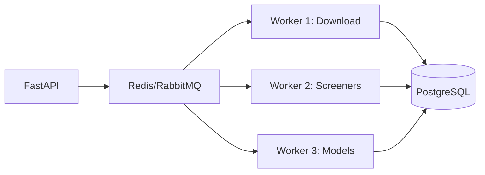
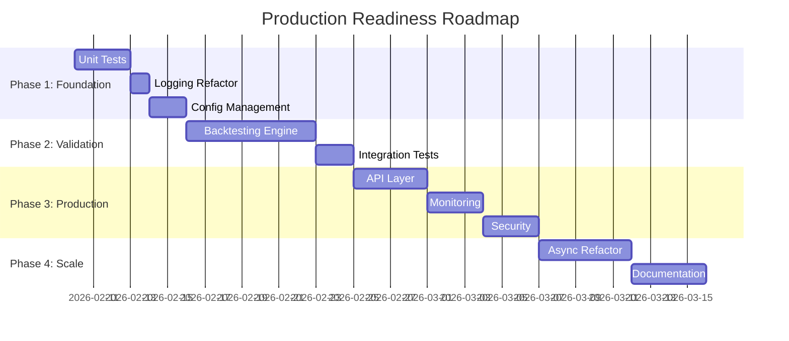

# Project Alpha - Production Readiness Gap Analysis

> A comprehensive analysis of missing components required to transform Project Alpha into a production-ready stock screening application.

---

## Executive Summary

| Category | Current State | Production Requirement | Gap Severity |
|----------|---------------|------------------------|--------------|
| Testing | 0% coverage | >80% coverage | 🔴 Critical |
| Backtesting | None | Full historical validation | 🔴 Critical |
| Monitoring | None | Full observability | 🔴 Critical |
| Configuration | Hardcoded values | Externalized config | 🟠 High |
| Error Handling | Print statements | Structured logging | 🟠 High |
| API Layer | None | REST/GraphQL API | 🟠 High |
| Security | Minimal | Auth, secrets management | 🟠 High |
| Scalability | Single-threaded | Async/distributed | 🟡 Medium |
| Documentation | Minimal README | Full developer docs | 🟡 Medium |

---

## 🔴 Critical Gaps

### 1. Testing Infrastructure

**Current:** No test files exist.

**Required Components:**
```
tests/
├── unit/
│   ├── test_database_manager.py    # CRUD operations
│   ├── test_screeners/
│   │   ├── test_breakout.py        # Signal accuracy
│   │   ├── test_trendline.py       # Trend detection
│   │   └── test_ma.py              # MA crossovers
│   ├── test_download.py            # Data fetching mocks
│   └── test_models.py              # Model I/O, convergence
├── integration/
│   ├── test_pipeline.py            # End-to-end workflow
│   └── test_data_consistency.py    # DB ↔ Pickle parity
├── fixtures/
│   └── sample_data.py              # Mock OHLCV data
└── conftest.py                     # Shared pytest fixtures
```

**Key Test Cases Needed:**
| Component | Test Scenario |
|-----------|---------------|
| `breakouts_screener()` | Confirm signal fires only when all 5 conditions met |
| `find_trend()` | Validate angle thresholds map to correct trend labels |
| `insert_price_rows()` | Handle duplicate dates, missing columns, empty DataFrames |
| `train_msis_mcs()` | Model converges within expected loss range |

---

### 2. Backtesting Framework

**Current:** No historical validation of strategy performance.

**Required Components:**

```python
# src/backtesting/
├── __init__.py
├── engine.py           # Core backtest loop
├── metrics.py          # Sharpe, drawdown, win rate
├── portfolio.py        # Position tracking
├── reports.py          # Performance visualization
└── strategies/
    ├── base.py         # Abstract strategy interface
    └── screener_adapter.py  # Wrap existing screeners
```

**Minimum Viable Backtester:**
```python
class BacktestEngine:
    def run(
        self,
        strategy: BaseStrategy,
        data: pd.DataFrame,
        start_date: str,
        end_date: str,
        initial_capital: float = 100_000,
    ) -> BacktestResult:
        """Execute strategy on historical data."""
        
class BacktestResult:
    total_return: float
    sharpe_ratio: float
    max_drawdown: float
    win_rate: float
    trades: list[Trade]
    equity_curve: pd.Series
```

**Required Metrics:**
| Metric | Formula | Purpose |
|--------|---------|---------|
| Total Return | `(final - initial) / initial` | Overall profitability |
| Sharpe Ratio | `mean(returns) / std(returns) * sqrt(252)` | Risk-adjusted return |
| Max Drawdown | `max(peak - trough) / peak` | Worst-case loss |
| Win Rate | `winning_trades / total_trades` | Signal accuracy |
| Profit Factor | `gross_profit / gross_loss` | Reward/risk ratio |

---

### 3. Monitoring & Observability

**Current:** Log files only, no metrics or alerting.

**Required Components:**

```yaml
# Monitoring stack
monitoring/
├── prometheus/
│   └── metrics.py          # Custom metrics exporter
├── grafana/
│   └── dashboards/
│       ├── screener_signals.json
│       └── data_pipeline.json
└── alerting/
    └── rules.yaml           # Alert conditions
```

**Key Metrics to Track:**
| Metric | Type | Purpose |
|--------|------|---------|
| `screener_signals_total` | Counter | Signals generated per screener |
| `data_download_duration_seconds` | Histogram | API latency |
| `model_training_loss` | Gauge | Model convergence |
| `cache_hit_ratio` | Gauge | Caching effectiveness |
| `symbols_processed_total` | Counter | Throughput |
| `errors_total` | Counter | Failure rate by component |

---

## 🟠 High-Priority Gaps

### 4. Configuration Management

**Current:** Hardcoded values scattered throughout code.

**Required:**
```python
# src/config/
├── __init__.py
├── settings.py          # Pydantic settings model
├── defaults.yaml        # Default configuration
└── schemas.py           # Validation schemas
```

**Configuration Schema:**
```python
from pydantic import BaseSettings

class Settings(BaseSettings):
    # Data
    market: Literal["us", "india"] = "us"
    data_dir: Path = Path("data")
    cache_ttl_hours: int = 24
    
    # Model
    model_order: int = 2
    learning_rate: float = 0.01
    training_steps: int = 10000
    
    # Screeners
    min_volume: int = 100_000
    breakout_selling_pressure_threshold: float = 0.40
    trend_angle_thresholds: dict = {
        "sideways": (-30, 30),
        "weak_up": (30, 60),
        "strong_up": (60, 90),
    }
    
    # Email
    smtp_host: str
    smtp_port: int = 587
    
    class Config:
        env_file = ".env"
```

---

### 5. Structured Logging & Error Handling

**Current:** `print()` statements and string returns for errors.

**Required:**
```python
# src/logging_config.py
import structlog

def configure_logging():
    structlog.configure(
        processors=[
            structlog.processors.TimeStamper(fmt="iso"),
            structlog.processors.JSONRenderer(),
        ],
        logger_factory=structlog.PrintLoggerFactory(),
    )

# Usage in screeners
logger = structlog.get_logger()

def breakout_screener(data, tickers):
    for ticker in tickers:
        try:
            result = breakouts_screener(data[ticker])
            logger.info("screener_complete", ticker=ticker, signal=result)
        except Exception:
            logger.exception("screener_failed", ticker=ticker)
            continue  # Don't fail entire batch
```

**Error Handling Pattern:**
```python
# Custom exceptions
class ProjectAlphaError(Exception):
    """Base exception for all application errors."""

class DataFetchError(ProjectAlphaError):
    """Failed to download market data."""

class ScreenerError(ProjectAlphaError):
    """Screener execution failed."""

class ModelTrainingError(ProjectAlphaError):
    """Model failed to converge."""
```

---

### 6. API Layer

**Current:** CLI-only interface.

**Required:**
```python
# src/api/
├── __init__.py
├── main.py              # FastAPI app
├── routes/
│   ├── screeners.py     # /api/v1/screeners/*
│   ├── predictions.py   # /api/v1/predictions/*
│   └── backtest.py      # /api/v1/backtest/*
├── schemas/
│   ├── requests.py
│   └── responses.py
└── dependencies.py      # DI for services
```

**API Endpoints:**
| Method | Endpoint | Purpose |
|--------|----------|---------|
| GET | `/api/v1/screeners` | List available screeners |
| POST | `/api/v1/screeners/{name}/run` | Execute screener |
| GET | `/api/v1/predictions/{market}` | Get volatility predictions |
| POST | `/api/v1/backtest` | Run backtest on strategy |
| GET | `/api/v1/symbols/{market}` | List symbols for market |

---

### 7. Security

**Current:** Email credentials in JSON file, no authentication.

**Required:**
```python
# src/security/
├── __init__.py
├── auth.py              # JWT/API key authentication
├── secrets.py           # Vault/env-based secrets
└── rate_limiting.py     # Request throttling
```

**Security Checklist:**
- [ ] Move credentials to environment variables or secrets manager
- [ ] Add API authentication (API keys or JWT)
- [ ] Implement rate limiting for data APIs
- [ ] Add input validation on all user-facing endpoints
- [ ] Audit logging for sensitive operations

---

## 🟡 Medium-Priority Gaps

### 8. Scalability

**Current:** Synchronous, single-machine execution.

**Required:**
```python
# src/workers/
├── __init__.py
├── celery_app.py        # Task queue configuration
├── tasks/
│   ├── download.py      # Async data fetching
│   ├── screen.py        # Parallel screener execution
│   └── train.py         # Distributed model training
```

**Architecture:**


---

### 9. Data Validation

**Current:** Minimal validation, trusts external data sources.

**Required:**
```python
# src/validation/
├── __init__.py
├── price_data.py        # OHLCV validation rules
├── symbols.py           # Ticker format validation
└── schemas.py           # Pydantic models
```

**Validation Rules:**
| Field | Rule |
|-------|------|
| `open`, `high`, `low`, `close` | Must be positive |
| `high` | Must be >= `low` |
| `volume` | Must be non-negative |
| `date` | Must be valid trading day |
| `symbol` | Must match expected format |

---

### 10. Documentation

**Current:** Two README files with basic usage.

**Required:**
```
docs/
├── index.md                 # Overview
├── getting-started/
│   ├── installation.md
│   ├── quickstart.md
│   └── configuration.md
├── user-guide/
│   ├── screeners.md         # Each screener explained
│   ├── volatility-model.md  # How predictions work
│   └── interpreting-signals.md
├── developer-guide/
│   ├── architecture.md
│   ├── contributing.md
│   ├── testing.md
│   └── adding-screeners.md
├── api-reference/
│   └── openapi.yaml
└── deployment/
    ├── docker.md
    └── kubernetes.md
```

---

## Implementation Effort Estimates

| Component | Effort | Dependencies |
|-----------|--------|--------------|
| Unit tests (core) | 2-3 days | pytest, pytest-mock |
| Integration tests | 2 days | Docker for DB |
| Backtesting engine | 5-7 days | None |
| Monitoring setup | 2-3 days | Prometheus, Grafana |
| Configuration refactor | 1-2 days | Pydantic |
| Logging refactor | 1 day | structlog |
| FastAPI layer | 3-4 days | FastAPI, Pydantic |
| Security hardening | 2-3 days | python-jose, passlib |
| Async refactor | 3-5 days | asyncio, aiohttp |
| Documentation | 3-4 days | MkDocs |

**Total Estimated Effort:** 25-35 developer days

---

## Phased Implementation Roadmap


