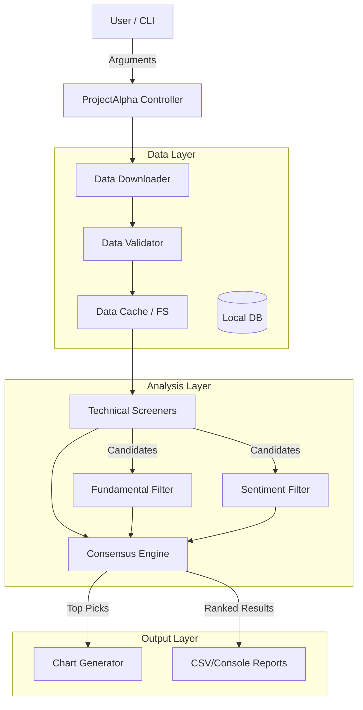

# System Architecture

## Overview
Project Alpha is a modular stock screening and analysis system designed to identify trading opportunities using technical and fundamental indicators. The system allows for flexible screening, backtesting, and automated reporting.

## High-Level Architecture

## Core Components

### 1. Data Layer
Responsible for acquiring, validating, and storing market data.
- **Download**: Fetches OHLCV data from yfinance.
- **Validators**: Enforces data quality (no NaNs, positive prices, volume checks).
- **Repairs**: Automatically fixes minor data arithmetic errors.
- **Cache**: Stores processed data in `data/` directory to minimize API calls.

### 2. Analysis Layer
The heart of the system, responsible for signal generation.
- **Screeners**:
    - `BreakoutScreener`: Detects consolidation breakouts (ADX, ATR).
    - `TrendlineScreener`: Identifies strong uptrends using linear regression.
    - `VolatilityScreener`: TensorFlow-based volatility categorization.
- **Filters**:
    - `FundamentalFilter`: Checks financial health (P/E, Debt/Equity) via Finnhub.
    - `SentimentFilter`: Analyzes news headlines using FinBERT (HuggingFace).
- **Consensus Engine**:
    - Aggregates signals from all screeners and filters.
    - Calculates a weighted confidence score (0.0 - 1.0).
    - Applies synergy bonuses for multi-strategy alignment.

### 3. Output Layer
Presenting results to the user.
- **Console**: Rich text tables and progress bars.
- **Charts**: Matplotlib-based technical charts with indicators.
- **Reports**: CSV exports for offline analysis.

## Data Flow

1.  **Initialization**: CLI args are parsed; configuration loaded from `settings.py`.
2.  **Data Loading**: Market index symbols (e.g., S&P 500) are loaded.
3.  **Data Fetching**: Historical data is downloaded and cached.
4.  **Validation**: Data integrity is checked; bad data is rejected or repaired.
5.  **Screening**:
    - Technical screeners identifying candidate stocks.
    - Candidates filtered by price/volume.
6.  **Refinement**:
    - Fundamental and Sentiment analysis run on candidates.
    - Results cached to optimize performance.
7.  **Consensus**:
    - Signals aggregated and scored.
    - Stocks ranked by consensus score.
8.  **Reporting**:
    - Top candidates displayed in console.
    - Charts generated for visual verification.
